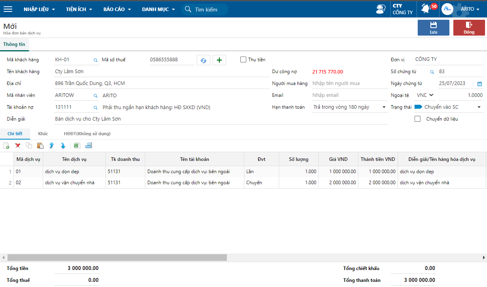

---
layout:
  title:
    visible: true
  description:
    visible: false
  tableOfContents:
    visible: true
  outline:
    visible: true
  pagination:
    visible: false
---

# \[DONE] Bán dịch vụ ghi nhận công nợ

## Mô tả nghiệp vụ

Khi bán dịch vụ và chưa thu tiền, kế toán lập hóa đơn bán dịch vụ để ghi nhận công nợ.

## Định khoản

**Hạch toán doanh thu:**

Nợ TK 131 Phải thu khách hàng

Có TK 511 Doanh thu bán hàng và cung cấp dịch vụ

Có TK 3331 Thuế GTGT phải nộp

## Các bước thực hiện

**Bước 1:** Vào hóa đơn theo đường dẫn: _**Bán hàng/ Hóa đơn bán ra/ Hóa đơn bán dịch vụ.**_&#x20;

**Bước 2:** Chọn biểu tượng **Thêm** trên thanh công cụ để thêm hóa đơn mới.

**Bước 3:** Nhập các thông tin trên hóa đơn và nhấn **Lưu.**

<figure><figcaption>
Hóa đơn bán dịch vụ
</figcaption></figure>

**Bước 4:** Chọn biểu tượng **In** trên chứng từ hoặc thanh công cụ để in chứng từ.
