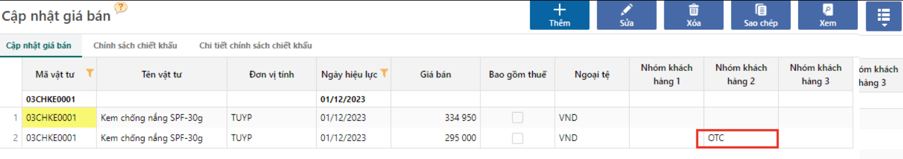

---
layout:
  title:
    visible: true
  description:
    visible: false
  tableOfContents:
    visible: true
  outline:
    visible: true
  pagination:
    visible: false
---

# Cập nhật giá bán

## Mô tả chung

Thiết lập chính sách giá là việc cập nhật bảng giá của doanh nghiệp vào phần mềm, nhằm mục đích:

* Quy định bảng giá bán niêm yết của công ty.
* Quy định bảng giá riêng cho 1 hoặc 1 nhóm đối tượng khách hàng cụ thể.
* Giúp người dùng theo dõi lịch sử biến động giá bán của doanh nghiệp.
* Khi lập các chứng từ đơn hàng, hóa đơn,... dựa vào bảng giá này để tự động lấy giá bán để tham chiếu và bớt thao tác người dùng.

## Nguyên tắc xử lý

**Ngày hiệu lực**

Ngày hiệu lực: Là ngày áp dụng của giá bán này. Khi có thay đổi về giá bán, người dùng sẽ cập nhật thêm 1 bản ghi mới với ngày hiệu lực mới, giữ nguyên giá bán cũ trước đó.&#x20;

<figure><figcaption>
Cập nhật và theo dõi biến động giá
</figcaption></figure>

**Giá riêng theo khách hàng**

Bảng giá niêm yết thông thường là bảng giá quy định cho các khách hàng lẻ, là khung giá cơ bản cho 1 sản phẩm của công ty. Thông thường đối với các khách hàng thân thiết, công ty thường có 1 bảng giá riêng chỉ áp dụng cho khách hàng này. Hệ thống cho phép khai báo giá riêng cho 1 khách hàng hoặc 1 nhóm đối tượng khách hàng cụ thể.&#x20;

Một khách hàng nếu đã có giá riêng thì khi bán hàng sẽ lấy mặc định giá này.

VD giá niêm yết bán lẻ của công ty là 334.950đ/ Tuyp, riêng các khách hàng thuộc nhóm OTC - Nhà thuốc sẽ có mức giá là 295.000đ/ Tuyp.

<figure><figcaption></figcaption></figure>

**Thứ tự ưu tiên khi lấy giá bán trên các chứng từ bán hàng**

Khi tạo chứng từ bán hàng, hệ thống sẽ lấy giá bán từ cập nhật giá bán theo thứ tự ưu tiên (từ trên xuống dưới) như sau:

* Ngày hiệu lực: Cùng 1 đối tượng, giá nào có ngày hiệu lực gần nhất thì sẽ lấy giá đó.
* Mã khách hàng: Cùng 1 ngày hiệu lực, cùng thuộc 1 nhóm khách, nếu 1 khách hàng có bảng giá riêng thì sẽ lấy giá riêng này.
* Nhóm khách hàng: Cùng ngày hiệu lực, nếu 1 khách hàng thuộc nhóm khách có bảng giá riêng, thì sẽ lấy giá riêng theo nhóm khách hàng.

**Giá đã bao gồm thuế**

Để nhận biết giá đưa vào là giá chưa thuế hay giá đã có thuế. Lưu ý nếu tick vào giá đã bao gồm thuế thì tất cả các mức giá cho vật tư này đều hiểu là giá đã có thuế.

Khi tính giá, phần mềm sẽ lấy giá đã bao gồm thuế/ thuế suất cập nhật trong danh mục vật tư.

## Hướng dẫn thao tác

### Cập nhật giá bán hàng loạt

Cách này sử dụng trong trường hợp:

* Lần đầu tiên sử dụng chương trình.
* Doanh nghiệp thay đổi chính sách giá hàng loạt.

**Bước 1:** Truy cập vào chức năng tại đường dẫn _**Bán hàng/Danh mục/Bán hàng/ Giá bán,**_ nhấn nút Thêm để cập nhật.

<figure><figcaption>
Khai báo giá bán
</figcaption></figure>

**Bước 2**: Cập nhật các thông tin giá bán, sau đó nhấn Lưu.

Để cập nhật cùng lúc nhiều giá bán cho sản phẩm, người dùng dùng chức năng import bằng excel (tham khảo [tại đây](http://127.0.0.1:5000/s/rcD7ImF1NXzNzFohN8p5/thao-tac-chuc-nang-tren-he-thong/import-du-lieu-tu-excel-vao-chuong-trinh)) .

### Cập nhật giá bán cho 1 sản phẩm

Cách này áp dụng cho trường hợp 1 sản phẩm mới tạo, sau khi tạo mã sản phẩm thì người dùng muốn thiết lập giá bán ngay.

**Bước 1**: Truy cập vào đường dẫn: _**Bán hàng/Danh mục/Đối tượng/ Vật tư, sản phẩm**_

**Bước 2**: Qua tab Giá bán của sản phẩm, nhấn **Thêm giá bán** để cập nhật giá, cập nhật thông tin và nhấn Lưu.

<figure><figcaption>
Cập nhật giá bán
</figcaption></figure>

