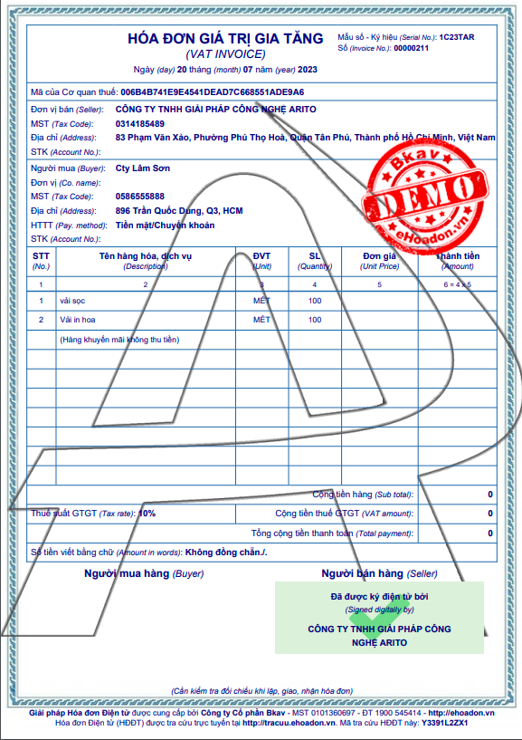
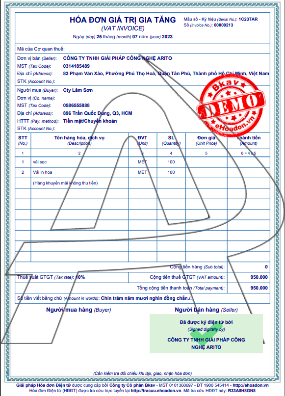

---
layout:
  title:
    visible: true
  description:
    visible: false
  tableOfContents:
    visible: true
  outline:
    visible: true
  pagination:
    visible: false
---

# Xuất hóa đơn hàng biếu tặng, khuyến mãi

## Mô tả nghiệp vụ

Ghi nhận các nghiệp vụ liên quan đến xuất hóa đơn hàng biếu tặng. Ở nghiệp vụ này sẽ chia ra 3 trường hợp:

* Hàng khuyến mãi kèm điều kiện, tính giá vốn hàng khuyến mãi.&#x20;
* Hàng biếu tặng không thu tiền, tính giá vốn vào chi phí khuyến mãi, không tính thuế.
* Hàng biếu tặng không thu tiền, tính giá vốn vào chi phí khuyến mãi, có tính thuế

## Hướng dẫn chi tiết

### Hàng khuyến mãi kèm điều kiện.

#### Định khoản

Nợ TK 632 Giá vốn hàng bán

Có TK 155, 156 Thành phẩm, hàng hóa

#### Các bước thực hiện

**Bước 1:** Lập hoá đơn bán hàng theo đường dẫn: _**Bán hàng/ Hóa đơn bán ra/ Hóa đơn bán hàng,**_ chọn nút **Thêm** trên thanh công cụ để thêm mới phiếu.

**Bước 2:** Ở tab Chi tiết, thêm mã sản phẩm và chọn Loại hàng là **Hàng KM**. Sau đó nhập tài khoản khuyến mãi.

<figure><figcaption>
Hóa đơn bán hàng có kèm hàng khuyến mãi
</figcaption></figure>

**Bước 2:** Hướng dẫn các bước xuất HDDT [tại đây](broken-reference).

### Trường hợp 2: Hàng biếu tặng không thu tiền, tính giá vốn vào chi phí khuyến mãi, không tính thuế

#### Định khoản

Nợ TK 641 Chi phí bán hàng

Có TK 155, 156 Thành phẩm, hàng hóa

#### Các bước thực hiện

**Bước 1:** Lập hoá đơn bán hàng theo đường dẫn: _**Bán hàng/ Hóa đơn bán ra/ Hóa đơn bán hàng,**_ chọn nút **Thêm** trên thanh công cụ để thêm mới phiếu.

**Bước 2:** Ở tab Chi tiết, nhập mã sản phẩm và chọn Loại hàng là **Hàng KM**.

<figure><figcaption>
Hóa đơn ghi nhận hàng KM không thu thuế
</figcaption></figure>

**Các thông tin cần lưu ý:**

* Nhập tài khoản giá vốn là TK 641.
* Chọn thuế suất thuế GTGT là 0%.

**Bước 2:** Hướng dẫn các bước xuất HDDT [tại đây](broken-reference).

<figure><figcaption>
Hóa đơn GTGT
</figcaption></figure>

### Trường hợp 3: Hàng biếu tặng không thu tiền, tính giá vốn vào chi phí khuyến mãi, có tính thuế

#### Định khoản

Nợ TK 641 Chi phí bán hàng

Có TK 155, 156 Thành phẩm, hàng hóa

Nợ 131 Phải thu khách hàng

Có 3331 Thuế GTGT phải nộp

#### Các bước thực hiện

**Bước 1:** Lập hoá đơn bán hàng theo đường dẫn: _**Bán hàng/ Hóa đơn bán ra/ Hóa đơn bán hàng,**_ chọn nút **Thêm** trên thanh công cụ để thêm mới phiếu.

**Bước 2:** Ở tab Chi tiết, nhập mã sản phẩm và chọn Loại hàng là **Hàng KM**. Sau đó nhấn **Lưu.**

<figure><figcaption></figcaption></figure>

**Các thông tin cần lưu ý:**

* Nhập tài khoản giá vốn là TK 641
* Nếu là mặc hàng khuyến mãi có nộp thuế, sau khi nhập các thông tin trên phiếu thì tick vào nút **Cố định tổng thuế** và nhập giá trị thuế.

**Bước 2:** Hướng dẫn các bước xuất HDDT [tại đây](broken-reference).

<figure><figcaption>
Hóa đơn GTGT
</figcaption></figure>
