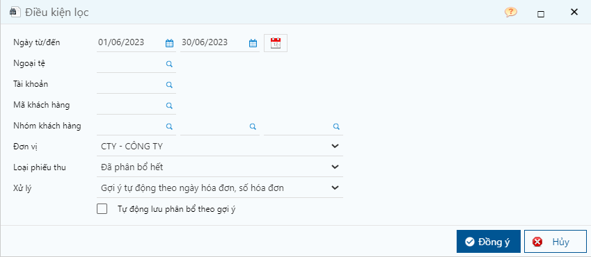

---
layout:
  title:
    visible: true
  description:
    visible: false
  tableOfContents:
    visible: true
  outline:
    visible: true
  pagination:
    visible: false
---

# Cách gỡ hóa đơn đã phân bổ

## Mô tả nghiệp vụ

Hóa đơn bán hàng đã phân bổ tiền thu, khi chọn sửa sẽ hiện cảnh báo và không cho sửa. Các hóa đơn bán đã phân bổ nhưng cần sửa thông tin hóa đơn người dùng cần gỡ phân bổ cho hóa đơn đó thì mới sửa phiếu được.

<figure><figcaption>
Hiện cảnh báo khi lưu
</figcaption></figure>

## Các bước thao tác

### Kiểm tra thông tin phân bổ của hóa đơn

**Bước 1:** Kiểm tra chứng từ thanh toán đã phân bổ cho hóa đơn bằng cách trỏ chuột vào nút chức năng trên hóa đơn và chọn **Thanh toán phải thu,** chương trình sẽ hiện chứng từ đã thanh toán.

<figure><figcaption>
Hóa đơn bán hàng
</figcaption></figure>

<figure><figcaption>
Màn hình chứng từ thanh toán của hóa đơn
</figcaption></figure>

**Bước 2:** Nhấn vào số c/từ dòng chứng từ thanh toán, sẽ hiện ra chứng từ thanh toán.

<figure><figcaption>
Chứng từ thanh toán
</figcaption></figure>

Ở đây có 2 trường hợp xử lý:

* Trường hợp 1: Chứng từ thanh toán là chứng từ loại 1. Thu theo hóa đơn
* Trường hợp 2: Chứng từ thanh toán là chứng từ loại 2. Thu theo đối tượng

### Trường hợp 1: Chứng từ thanh toán (loại 1. Thu theo hóa đơn) phân bổ trực tiếp hóa đơn

Để sửa được hóa đơn đã phân bổ, nếu không ảnh hưởng gì về giá trị hóa đơn cũng như tiền thu thì chuyển trạng thái chứng từ thu (loại 1. Thu theo đối tượng) về trạng thái **Lập chứng từ.** Sau đó sửa lưu hóa đơn và trả lại trạng thái cho chứng từ thanh toán.

**Bước 1:** Tại màn hình chứng từ thanh toán khi xem trong hóa đơn, nhấn nút **Sửa**.

**Bước 2:** Chọn trạng thái **Lập chứng từ** và nhấn **Lưu**.

<figure><figcaption></figcaption></figure>

### Trường hợp 2: Chứng từ thanh toán (loại 2. Thu theo đối tượng) phân bổ gián tiếp bằng chức năng phân bổ tiền thu cho hóa đơn

Để sửa được hóa đơn đã phân bổ, cần xóa phân bổ chứng từ thanh toán đã phân bổ cho hóa đơn**.** Sau đó sửa lưu hóa đơn và phân bổ lại chứng từ thanh toán này.

**Bước 1:** Vào màn hình phân bổ theo đường dẫn: _**Kế toán/ Bán hàng/ Tiện ích/ Phân bổ thu tiền cho các hóa đơn**_

**Bước 2:** Nhập các thông tin để lọc chứng từ thanh toán và nhấn **Đồng ý.**

<figure><figcaption>
Nhập điều kiện lọc
</figcaption></figure>

**Các thông tin cần lưu ý:**

* Nhập ngày từ/đến là ngày phát sinh chứng từ thanh toán.
* Loại chứng từ: chọn loại **Đã phân bổ hết** hoặc **Tất cả** để lọc các chứng từ thanh toán đã phân bổ.

**Bước 3:** Xử lý gỡ phân bổ bằng cách nhấn vào chứng từ thanh toán cần gỡ phân bổ và nhấn nút **Xóa phân bổ.**

<figure><figcaption>
Màn hình xóa phân bổ
</figcaption></figure>

**Các thông tin cần lưu ý:**

* Khi Xóa phân bổ, chương trình sẽ xóa phân bổ tất cả hóa đơn đã thực hiện phân bổ trên cùng phiếu chi.
