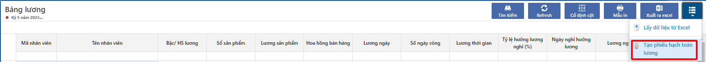
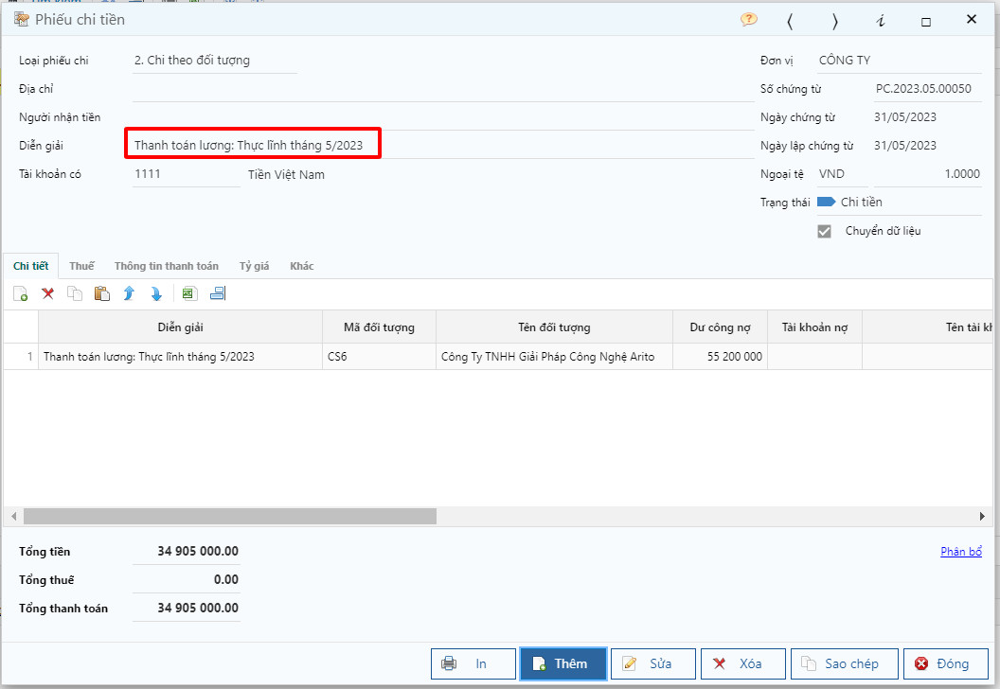

---
layout:
  title:
    visible: true
  description:
    visible: false
  tableOfContents:
    visible: true
  outline:
    visible: true
  pagination:
    visible: false
---

# \[DONE] Tạo phiếu hạch toán lương

## Mô tả

Đây là chức năng hỗ trợ tạo chứng từ kế toán từ bảng lương đã tạo lập. Để tạo phiếu thì cần khai báo thông tin hạch toán tại phần khai báo Chỉ tiêu lương.

## Các bước thực hiện

**Bước 1**: Truy cập bảng lương tại đường dẫn _**Bảng lương/ Báo cáo/ Bảng lương**_ và tạo bảng lương.

**Bước 2**: Nhấp vào biểu tượng **Tạo phiếu hạch toán lương,** nhập ngày hạch toán, tick Xem chứng từ đã tạo và nhấn **Đồng ý**.

<figure><figcaption></figcaption></figure>

<figure><figcaption></figcaption></figure>

**Bước 3**: Kiểm tra chứng từ hạch toán được sinh từ chức năng này và sửa lại thông tin (nếu có)

<figure><figcaption></figcaption></figure>
