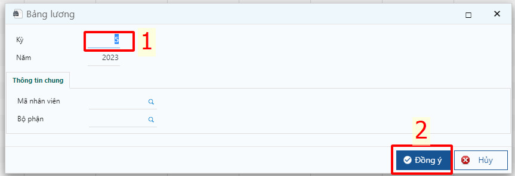

---
layout:
  title:
    visible: true
  description:
    visible: false
  tableOfContents:
    visible: true
  outline:
    visible: true
  pagination:
    visible: false
---

# \[DONE] Tạo bảng lương

## Mô tả

Cuối tháng sau khi chốt công làm việc của nhân viên, kế toán tiến hành tạo bảng lương và cập nhật trên phần mềm để lưu trữ và hỗ trợ tính toán, tạo hạch toán kế toán.

## Các bước thực hiện

**Bước 1**: Truy cập chức năng bảng lương tại đường dẫn _**Bảng lương/ Báo cáo/ Bảng lương,**_ lọc kỳ tính lương và nhấn **Đồng ý**.

<figure><figcaption></figcaption></figure>

**Bước 2**: Nhấp vào biểu tượng **Kết xuất Excel** trên thanh công cụ của Bảng lương để kết xuất thông tin chi tiết của từng nhân viên và các chỉ tiêu lương đã khai báo.

<figure><figcaption></figcaption></figure>

**Bước 3**: Nhập số ngày công và các chỉ tiêu tự cập nhật vào file excel đã tải ở bước 2. Với các chỉ tiêu công thức thì file excel sẽ tự động tính toán.

**Bước 4**: Nhấp vào Biểu tượng **Lấy dữ liệu từ Excel** tên thanh công cụ của Bảng lương đã khai báo trên File excel.

<figure><figcaption></figcaption></figure>

Mẫu báo cáo được thiết lập trong Bảng lương, dựa vào khai báo các chỉ tiêu trong khai báo mẫu để lên số liệu Báo cáo.

**Bước 5**: Nhấn vào nút chức năng Mẫu in để in bảng lương ký nhận và lưu trữ.
