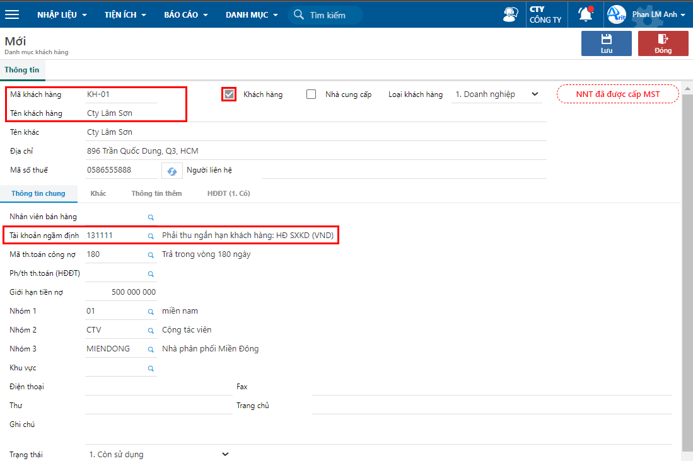

---
layout:
  title:
    visible: true
  description:
    visible: false
  tableOfContents:
    visible: true
  outline:
    visible: true
  pagination:
    visible: false
---

# Danh mục khách hàng

Tính năng này nhằm hỗ trợ quản lý thông tin khách hàng (mã khách hàng, tên khách hàng, địa chỉ,...) Ngoài ra, màn hình khai báo này còn hỗ trợ các tiện ích như sau:

* Mặc định thông tin khi nhập liệu: Tài khoản công nợ, hạn thanh toán, nhân viên bán hàng
* Quy định giới hạn tiền nợ
* Phân nhóm khách hàng

### Thao tác cập nhật thông tin khách hàng

**Bước 1:** Vào danh mục khách hàng theo đường dẫn: _**Danh mục/  Đối tượng /Khách hàng**_

**Bước 2**: Nhấn nút **Thêm**, để tạo mới thông tin khách hàng.

**Bước 3**: Nhập các thông tin trên phiếu và nhấn **Lưu.**

<figure><figcaption>
Khai báo thông tin khách hàng
</figcaption></figure>

**Các thông tin lưu ý:**

* Check chọn Khách hàng là mặc định, nếu đối tượng này vừa là khách hàng vừa là nhà cung cấp thì check thêm vào Nhà cung cấp.
* Loại khách hàng: Dùng để xử lý khi phát hành hóa đơn điện tử:
  * Doanh nghiệp: Khi tạo lập và phát hành hóa đơn yêu cầu phải nhập đủ thông tin tên công ty, mã số thuế, địa chỉ.
  * Cá nhân: Khi tạo lập và phát hành hóa đơn cho phép để trắng thông tin mã số thuế, địa chỉ.
* Tài khoản ngầm định: Khai báo tài khoản ngầm định trên các chứng từ bán hàng, khi tạo lập phiếu chương trình sẽ lấy ra và cho sửa lại.
* Mã th.toán công nợ: Là mã quy định số ngày nợ của khách hàng, dùng để mặc định khi tạo lập hóa đơn bán hàng và tính tuổi nợ.
* Giới hạn tiền nợ: Số tiền tối đa khách hàng có thể nợ. Tổng tiền nợ lũy kế của khách hàng tính bằng số tiền chưa thanh toán + giá trị các đơn hàng đang thực hiện. Nếu để bằng 0 thì hiểu là không có giới hạn nợ.
* Tiện ích nhập nhanh thông tin khách hàng bằng cách nhập mã số thuế và bấm nút tra cứu bên cạnh. Lúc đó chương trình sẽ tự động lấy ra tên công ty, địa chỉ, người đại diện.

**Bước 3**: Phân nhóm khách hàng

<figure><figcaption>
Khai báo danh mục phân nhóm
</figcaption></figure>

Nhóm khách hàng 1/2/3 dùng để phân loại khách hàng theo các phân nhóm. Nhằm hỗ trợ khi kiểm tra các báo cáo bán hàng, phân tích số liệu kinh doanh

VD: Nhóm khách hàng 1&#x20;

* Nhóm khách hàng 1: Khách hàng sỉ, Khách hàng lẻ
* Nhóm khách hàng 2: Phân theo khu vực(miền bắc, miền trung, miền nam)
* Nhóm khách hàng 3: Phân theo tỉnh thành

Khai báo nhóm khách hàng 1/2/3 tại _**Danh mục/ Bán hàng/ Phân nhóm khách hàng**_
