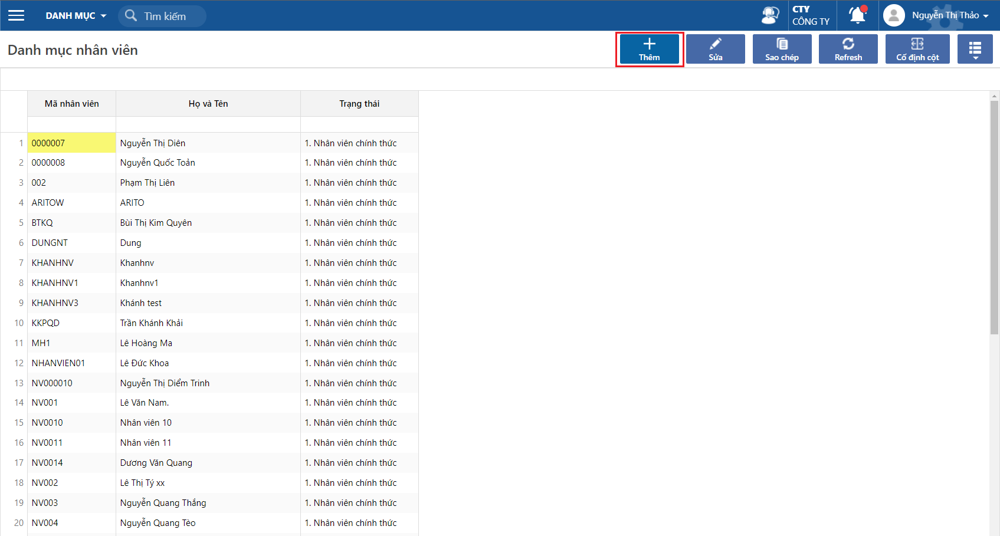

# Danh mục nhân viên

Màn hình dùng để khai báo danh sách thông tin nhân viên của công ty dùng riêng cho phân hệ kế toán, dùng cho việc quản lý, theo dõi tình hình bán hàng, mua hàng, tạm ứng theo từng nhân viên.

### Thao tác cập nhật thông tin nhà cung cấp

Đường dẫn: _**Danh mục/ Nhân viên**_

**Bước 1**: Click chọn THÊM, để tạo mới thông tin nhân viên

<figure><figcaption></figcaption></figure>

**Bước 2**: Cập nhật thông tin nhà cung cấp

<figure><figcaption></figcaption></figure>

Các thông tin lưu ý bắt buộc phải có khi tạo thông tin nhân viên

* Mã nhân viên
* Họ và tên

Ngoài ra có các thông tin cần lưu ý thêm như:

* Ô check Bán hàng: nếu có tick vào thì khi ở đơn hàng bán hoặc hoá đơn bán hàng sẽ chọn được các mã nhân viên có tick vào Bán hàng.
* Ô check Mua hàng: nếu có tick vào thì khi ở đơn hàng mua hoặc hoá đơn mua hàng sẽ chọn được các mã nhân viên có tick vào Mua hàng.
* Ô check Công nợ/ tạm ứng: nếu có tick vào thì khi ở các chứng từ thanh toán, tạm ứng tiền sẽ chọn được các mã nhân viên có tick vào Công nợ/ tạm ứng.
