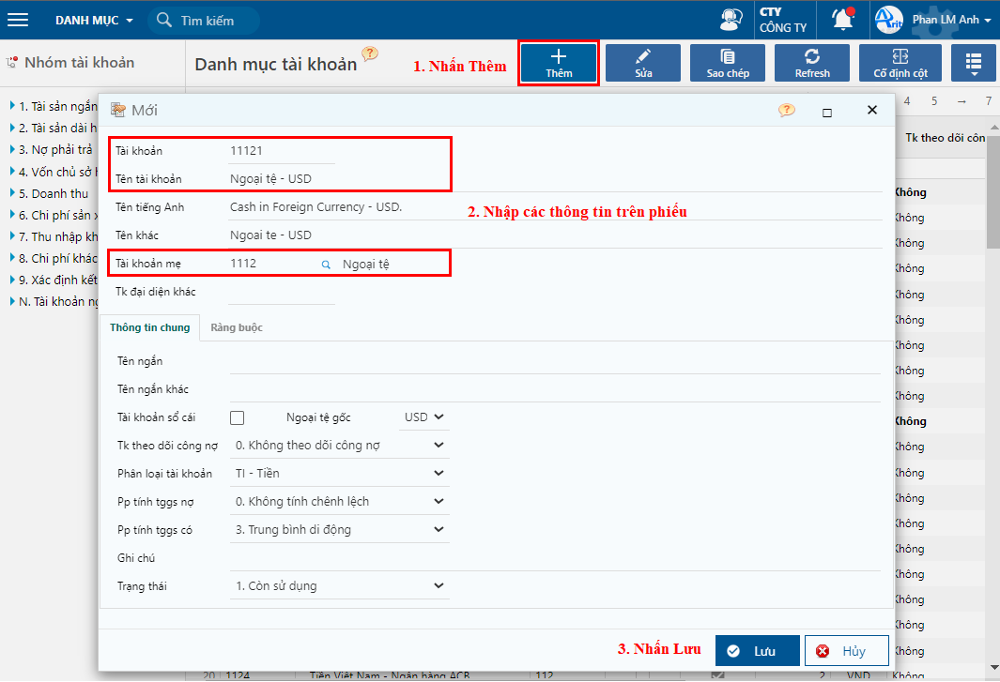

---
layout:
  title:
    visible: true
  description:
    visible: false
  tableOfContents:
    visible: true
  outline:
    visible: true
  pagination:
    visible: false
---

# Danh mục tài khoản

Sau khi chọn chế độ kế toán theo thông tư 200 hoặc thông tư 133 thì chương trình sẽ tự động hiện danh mục tài khoản. Người dùng có thể khai báo thêm các tài khoản chi tiết để theo dõi chi tiết.

## Các bước thực hiện

**Bước 1:** Vào danh mục tài khoản theo đường dẫn: _**Danh mục/ Đối tượng/ Hệ thống tài khoản.**_

**Bước 2:** Nhấn nút Thêm trên thanh công cụ để thêm mới tài khoản.

**Bước 3:** Nhập các thông tin khai báo tài khoản và nhấn **Lưu.**

<figure><figcaption>
Khai báo thông tin tài khoản
</figcaption></figure>

**Các thông tin cần lưu ý:**

* Ngoại tệ gốc: Tài khoản có phát sinh ở các loại ngoại tệ khác nhau thì phải tách tiểu khoản.
* TK đại diện khác: Sử dụng cho các doanh nghiệp cần báo cáo về cho công ty mẹ hoặc tập đoàn, tại đó có quy định bộ tài khoản khác.
* TK theo dõi công nợ: Nếu tài khoản có theo dõi công nợ, sẽ có số dư 2 bên và khi nhập liệu bắt buộc phải nhập mã đối tượng.
* Phân loại tài khoản có 4 loại: Không phân loại, thuế, tiền, công nợ.
* Phương pháp tính tỷ giá ghi sổ nợ: dùng để khai báo phương pháp tính tỷ giá ghi sổ bên nợ cho các tài khoản ngoại tệ.
* Phương pháp tính tỷ giá ghi sổ có: dùng để khai báo phương pháp tính tỷ giá ghi sổ bên có cho các tài khoản ngoại tệ.
