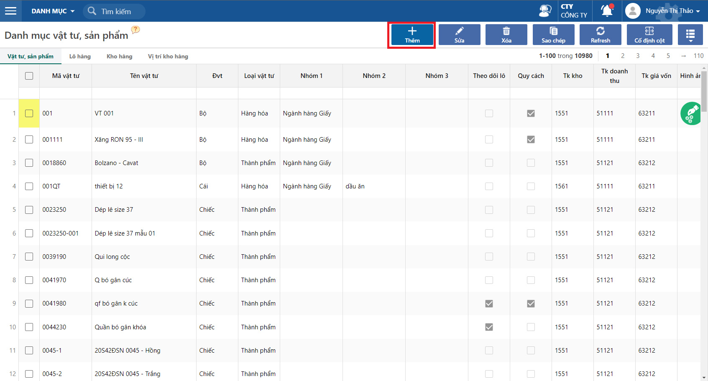

---
layout:
  title:
    visible: true
  description:
    visible: false
  tableOfContents:
    visible: true
  outline:
    visible: true
  pagination:
    visible: false
---

# Danh mục vật tư, sản phẩm

Tính năng này dùng để khai báo tất cả danh mục hàng hoá, vật tư, sản phẩm

Mặc định các thông tin hỗ trợ trong quá trình nhập liệu như: mã thuế, các tài khoản, mã kho,....

Phân nhóm vật tư, sản phẩm phục vụ cho việc thống kê, báo cáo.

## Thao tác cập nhật thông tin sản phẩm

Đường dẫn: _**Danh mục/ Vật tư, sản phẩm**_

**Bước 1**: Click chọn THÊM, để tạo mới thông tin sản phẩm

<figure><figcaption></figcaption></figure>

**Bước 2**: Cập nhật thông tin sản phẩm

<figure><figcaption></figcaption></figure>

**Thông tin chung**:

* Đơn vị tính: Đơn vị tính theo dõi tồn kho. Lưu ý nên khai báo đơn vị tính nhỏ nhất nếu vật tư có nhiều đơn vị tính để không bị số lẻ khi quy đổi.
* Theo dõi tồn kho: Nếu tick vào tùy chọn này thì các báo cáo tồn kho mặc định hiện, còn không tick thì có thể loại bỏ ra khi xem báo cáo tồn.
* Cách tính giá tồn kho: Chọn phương pháp tính giá.
* Loại vật tư: Phân loại vật tư, hàng hóa.&#x20;
* Nhóm vật tư 1/2/3: Phân loại nhóm vật tư, hệ thống hỗ trợ phân chia vào 3 nhóm.
* Theo dõi lô: Theo dõi tồn kho theo lô, date, hạn sử dụng.
* Theo dõi tồn quy cách: Theo dõi tồn kho vật tư theo quy cách, hệ thống cho phép theo dõi tối đa 3 đối tượng. Đồng thời khi tick vào sẽ hiện Tab quy cách của sản phẩm để khai báo (tham khảo chi tiết [tại đây](http://127.0.0.1:5000/s/8XowuU3e1r2eaKN2nT9D/quy-trinh-theo-doi-hang-ton-theo-quy-cach))

<figure><figcaption></figcaption></figure>

**Tab Tài khoản**: Dùng để khai báo các tài khoản mặc định khi phát sinh trên các chứng từ. Các tài khoản này được khai báo mặc định theo loại vật tư tại đường dẫn _**Danh mục/ Đặc tính sản phẩm/ Loại vật tư.**_

<figure><figcaption></figcaption></figure>

* Nếu tick vào cho phép sửa tài khoản vật tư khi nhập liệu trên chứng từ: thì trên các chứng từ nếu có vật tư khai báo tài khoản vật tư sẽ được sửa, không tick sẽ không được sửa tài khoản vật tư đó.

**Tab Quy đổi đvt**: Dùng để khai báo hệ số quy đổi về đơn vị tính gốc trong trường hợp vật tư/sản phẩm theo dõi nhiều đơn vị tính.

<figure><figcaption></figcaption></figure>

**Tab Giá bán**: Dùng để khai báo giá bán của sản phẩm

<figure><figcaption></figcaption></figure>

Tham khảo hướng dẫn cập nhật giá bán ([tại đây](broken-reference))
