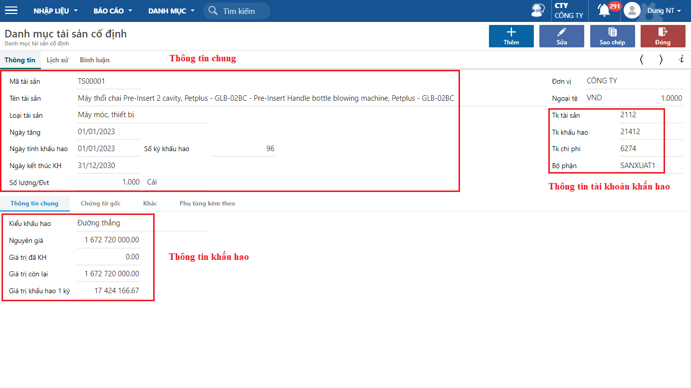

---
layout:
  title:
    visible: true
  description:
    visible: false
  tableOfContents:
    visible: true
  outline:
    visible: true
  pagination:
    visible: false
---

# Cập nhật danh sách TSCĐ

Dùng để cập nhật danh sách tài sản cố định (TSCĐ) của công ty phát sinh từ trước khi sử dụng chương trình. Đây là cơ sở để chương trình tính khấu hao và xử lý lên báo cáo.

## **Các bước thao tác**

**Bước 1:** Truy cập màn hình khai báo theo đường dẫn _**Tài sản/ Nhập liệu/ Khai báo thông tin tài sản cố định**_

**Bước 2:** Nhấn **Thêm,** nhập các thông tin của tài sản và **Lưu**.

<figure><figcaption>
Khai báo thông tin tài sản cố định
</figcaption></figure>

**Một số lưu ý**

* Người dùng có thể chọn một trong hai kiểu khấu hao tài sản (phương pháp khấu hao) là Đường thằng hoặc Số dư giảm dần.
* Nếu tài sản đã trích khấu hao trừ trước đó thì cần nhập giá trị đã khấu hao để chương trình xử lý tính khấu hao dựa trên giá trị còn lại của tài sản.
* Chương trình dựa trên nguyên giá và số kỳ khấu hao để tính giá trị khấu hao một kỳ. Người dùng vẫn có thể điều chỉnh lại bằng cách nhập tay giá trị khấu hao 1 kỳ.
* Thông tin hạch toán của bút toán khấu hao tự động hàng kỳ được lấy từ thông tin tài khoản khấu hao (Nợ TK chi phí/ Có TK khấu hao).

Người dùng có thể cập nhật danh sách tài sản cố định bằng thao tác import từ excel vào phần mềm. Xem hướng dẫn thao tác import từ excel [tại đây.](http://127.0.0.1:5000/s/rcD7ImF1NXzNzFohN8p5/thao-tac-chuc-nang-tren-he-thong/import-du-lieu-tu-excel-vao-chuong-trinh)

