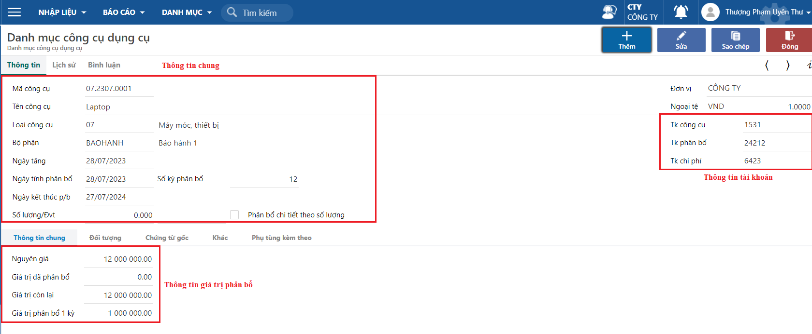

---
layout:
  title:
    visible: true
  description:
    visible: false
  tableOfContents:
    visible: true
  outline:
    visible: true
  pagination:
    visible: false
---

# Cập nhật danh sách CCDC

Dùng để cập nhật danh sách công cụ dụng cụ (CCDC) và chi phí trả trước của công ty phát sinh từ trước khi sử dụng chương trình. Đây là cơ sở để chương trình tính phân bổ và xử lý lên báo cáo.

## **Các bước thao tác**

**Bước 1:** Truy cập màn hình khai báo theo đường dẫn _**Công cụ/ Nhập liệu/ Khai báo thông tin công cụ dụng cụ**_

**Bước 2:** Nhấn **Thêm** và nhập các thông tin của công cụ dụng cụ

<figure><figcaption>
Màn hình nhập liệu
</figcaption></figure>

**Một số lưu ý:**

* Nếu công cụ dụng cụ đã phân bổ trước đó thì cần nhập giá trị đã phân bổ để chương trình xử lý tính phân bổ dựa trên giá trị còn lại của công cụ dụng cụ.&#x20;
* Chương trình dựa trên nguyên giá và số kỳ phân bổ để tính giá trị phân bổ một kỳ. Người dùng cũng có thể điều chỉnh bằng cách nhập tay giá trị phân bổ 1 kỳ
* Thông tin hạch toán của bút toán phân bổ tự động hàng kỳ được lấy từ thông tin tài khoản phân bổ (Nợ TK chi phí/ Có TK phân bổ).

Người dùng có thể cập nhật danh sách công cụ dụng cụ bằng thao tác import từ excel vào phần mềm. Xem hướng dẫn thao tác import từ excel [tại đây.](http://127.0.0.1:5000/s/rcD7ImF1NXzNzFohN8p5/thao-tac-chuc-nang-tren-he-thong/import-du-lieu-tu-excel-vao-chuong-trinh)
