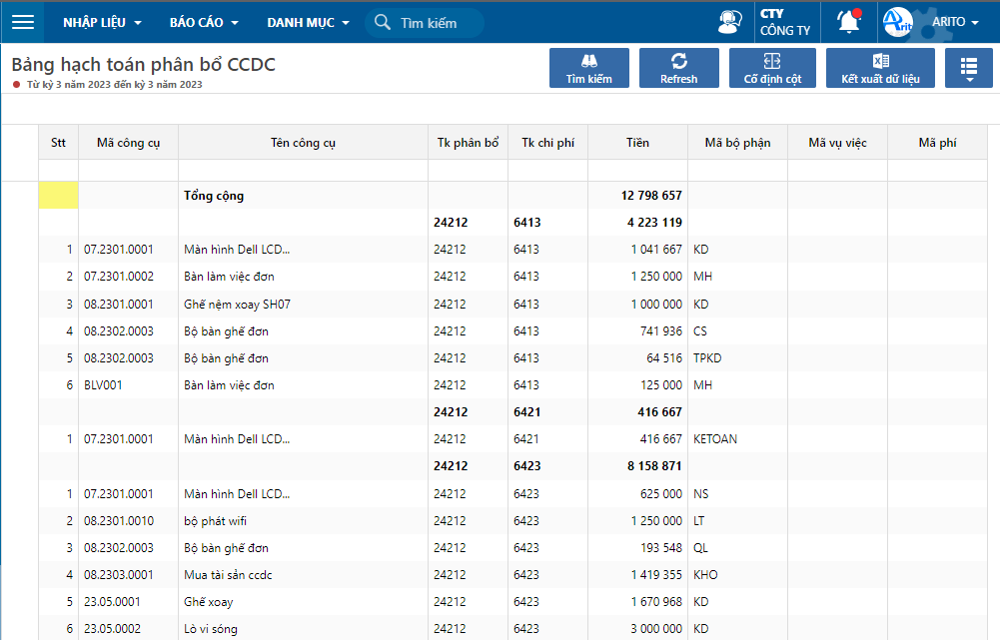

---
layout:
  title:
    visible: true
  description:
    visible: false
  tableOfContents:
    visible: true
  outline:
    visible: true
  pagination:
    visible: false
---

# Bảng hạch toán phân bổ công cụ dụng cụ

Báo cáo hỗ trợ theo dõi phân bổ công cụ chi tiết theo tài khoản.

## Các bước thực hiện

**Bước 1:** Vào báo cáo theo đường dẫn: _**Công cụ/ Báo cáo/ Phân bổ CCDC/ Bảng hạch toán phân bổ CCDC.**_

**Bước 2:** Nhập điều kiện lọc và nhấn **Đồng ý.**

<figure><figcaption>
Nhập điều kiện lọc báo cáo
</figcaption></figure>

<figure><figcaption>
Bảng hạch toán phân bổ CCDC
</figcaption></figure>
