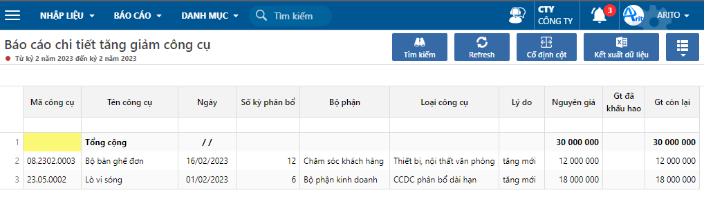

---
layout:
  title:
    visible: true
  description:
    visible: false
  tableOfContents:
    visible: true
  outline:
    visible: true
  pagination:
    visible: false
---

# Báo cáo chi tiết tăng giảm công cụ dụng cụ

Dùng để theo dõi chi tiết tình hình tăng (do mua mới, sửa chữa,...) hoặc giảm (do thanh lý, tháo dỡ phụ tùng,...) của công cụ theo từng kỳ.

## Báo cáo chi tiết tăng giảm công cụ: Loại tăng

**Bước 1:** Vào báo cáo theo đường dẫn: _**Công cụ/ Báo cáo/ Tăng/giảm CCDC/ Báo cáo chi tiết tăng/giảm CCDC.**_&#x20;

**Bước 2:** Nhập điều kiện lọc và nhấn **Đồng ý.**

<figure><figcaption>
Nhập điều kiện lọc
</figcaption></figure>

**Các thông tin cần lưu ý:**

* Từ kỳ/năm đến kỳ/năm: lọc theo thời gian ghi nhận tăng/giảm công cụ.
* Chọn loại Tăng/Giảm: báo cáo thể hiện theo mã loại chọn trên khai báo điều chỉnh giá trị tài sản.

<figure><figcaption>
Báo cáo chi tiết tăng giảm công cụ: Loại tăng
</figcaption></figure>

<figure><figcaption>
Báo cáo chi tiết tăng giảm công cụ: Loại giảm
</figcaption></figure>
