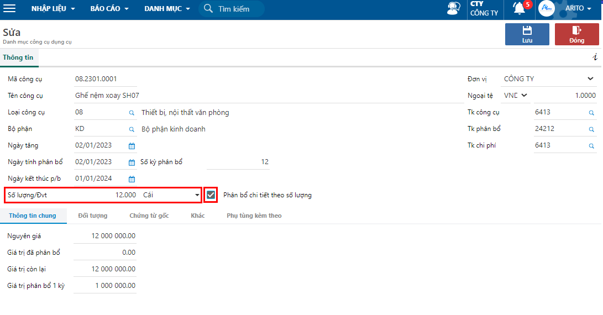

---
layout:
  title:
    visible: true
  description:
    visible: false
  tableOfContents:
    visible: true
  outline:
    visible: true
  pagination:
    visible: false
---

# Điều chuyển chi tiết CCDC theo số lượng

## Tính năng

Hướng dẫn các thao tác điều chuyển và theo dõi CCDC chi tiết theo số lượng.

## Các bước thực hiện 

### Khai báo phân bổ theo số lượng

**Bước 1:** Khai báo CCDC có phân bổ chi tiết theo số lượng theo đường dẫn: _**Kế toán/ Công cụ/ Nhập liệu/ Khai báo tăng/giảm CCDC/ Khai báo thông tin công cụ dụng cụ.**_

**Bước 2:** Trên thanh công cụ, chọn **Thêm** nếu khai báo công cụ mới. Chọn **Sửa** nếu công cụ đã có sẵn.

<figure><figcaption>
Danh mục công cụ dụng cụ
</figcaption></figure>

**Bước 3:** Nhập số lượng/Đvt và check chọn Phân bổ chi tiết theo số lượng

<figure><figcaption>
Khai báo thông tin công cụ
</figcaption></figure>

### Điều chuyển CCDC chi tiết theo số lượng.

**Bước 1:** Vào phiếu điều chuyển theo đường dẫn: _**Kế toán/ Công cụ/ Nhập liệu/ Điều chuyển CCDC/ Điều chuyển/báo giảm số lượng chi tiết công cụ.**_

**Bước 2:** Chọn nút **Thêm** trên thanh công cụ để thêm mới phiếu.

**Bước 3:** Chọn nghiệp vụ là **Điều chuyển** và nhập các thông tin chung sau đó nhấn **Lưu.**

<figure><figcaption>
Điều chuyển công cụ chi tiết theo số lượng
</figcaption></figure>

**Các thông tin cần lưu ý:**

* Ở phần thông tin: Nhập mã công cụ và bộ phận chuyển là bộ phận hiện tại của công cụ.
* Ở tab chi tiết: Nhập bộ phận nhận, số lượng điều chuyển và các tài khoản cần theo dõi.
