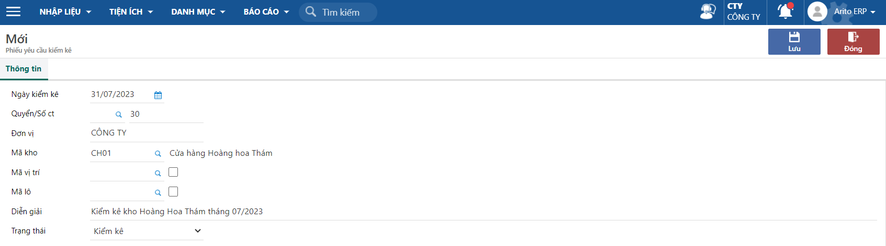
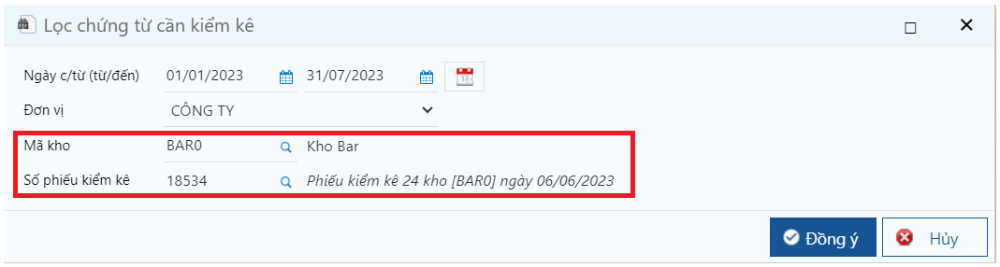
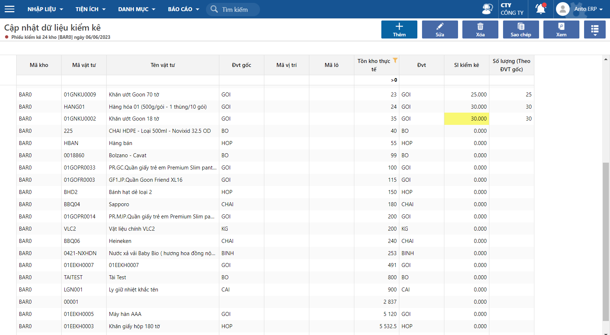
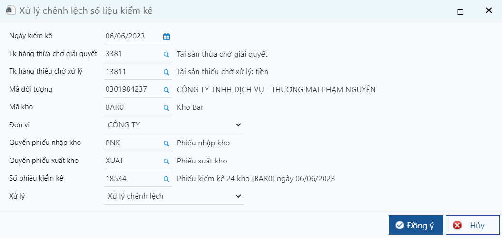
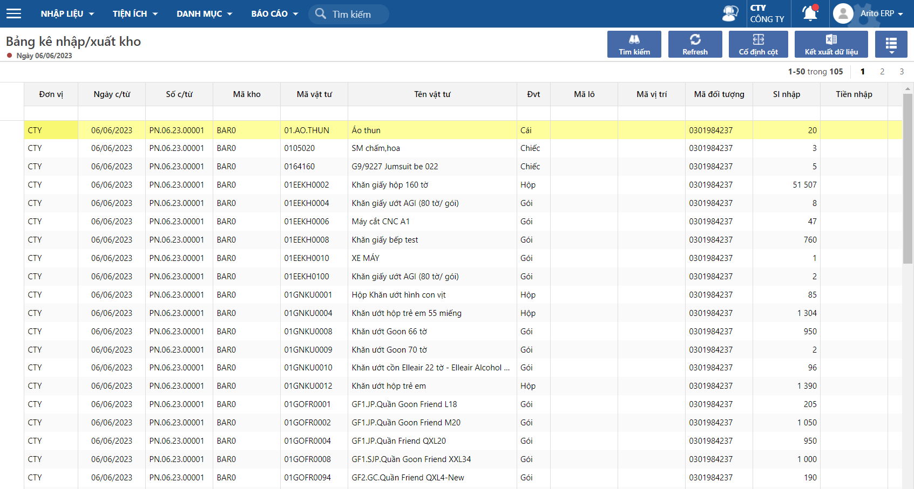
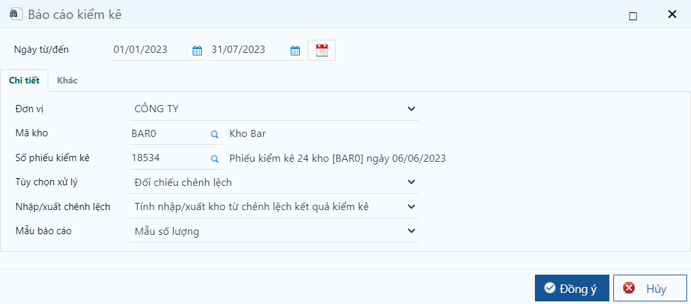
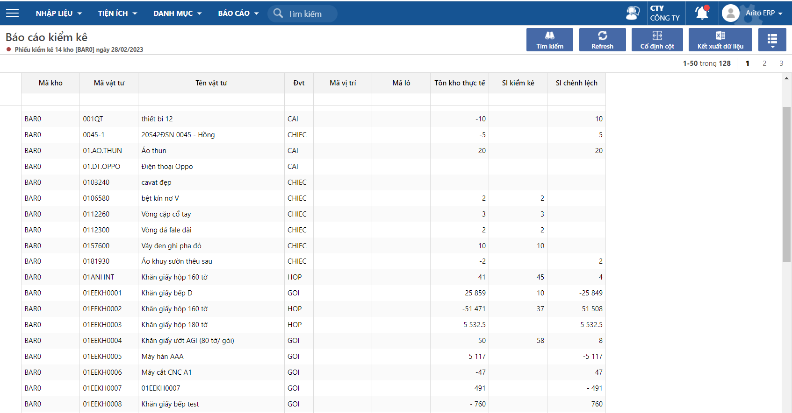

---
layout:
  title:
    visible: true
  description:
    visible: false
  tableOfContents:
    visible: true
  outline:
    visible: true
  pagination:
    visible: false
---

# Kiểm kê kho

Kiểm kê hàng tồn kho định kì là việc cần làm đối với mọi doanh nghiệp, đóng vai trò vô cùng cùng quan trọng và hết sức cần thiết, chủ yếu trong hoạt động quản trị sản xuất tác nghiệp. Vì hàng tồn kho là một trong những tài sản có giá trị lớn nhất trên tổng giá trị tài sản của doanh nghiệp. Hàng tồn kho giúp một doanh nghiệp có thể đạt được hiệu quả kinh tế của sản lượng lớn, cân bằng cung và cầu, liên kết giữa những mắt xích trong chuỗi cung ứng

## Các thao tác kiểm kê

### Bước 1: Tạo phiếu yêu cầu kiểm kê

Khi có nhu cầu kiêm kê hàng hóa trong kho, Người dùng sẽ lập phiếu yêu cầu kiểm kê để yêu cầu bộ phận Kho kiểm kê

Đường dẫn: **Phân hệ kho/Kiểm kê/Phiếu yêu cầu kiểm kê**

<figure><figcaption>
Phiếu yêu cầu kiểm kê
</figcaption></figure>

Các thông tin cần lưu ý:

* Ngày kiểm kê: Là ngày sẽ thực hiện kiểm kê và xử lý các chênh lệch khi kiểm kê
* Đơn vị: Trường hợp có nhiều đơn vị cơ sở thì chọn lại. Nếu không chọn sẽ mặc định đơn vị cơ sở  đang làm việc
* Mã kho: Chọn mã kho cần kiểm kê
* Trường hợp cần kiểm kê chi tiết **Mã lô** hoặc **Mã vị trí** thì khai báo. Nếu không có thể bỏ qua
* Trạng tháo chọn là Kiểm kê

### Bước 2: Cập nhật số liệu kiểm kê

Sau khi đã kiểm kê kho ngoài thực tế, người phụ trách phải cập nhật số lượng thực tế vào phần mềm

Đường dẫn: **Phân hệ kho/Kiểm kê/Cập nhật kiểm kê**

<figure><figcaption>
Lọc phiếu kiểm kê
</figcaption></figure>

<figure><figcaption>
Cập nhật kiểm kê
</figcaption></figure>

Phần mềm sẽ thể hiển tất cả mặt hàng đã từng phát sinh tại mã kho đã chọn và hiển thị số lượng tồn kho thực tế tại kho đã chọn.

Các cách cập nhật số liệu vào phần mềm:

* Cập nhật trực tiếp vào cột **Sl kiểm kê** theo từng sản phẩm
* Import dữ liệu từ file excel (tham khảo [tạo đây](http://127.0.0.1:5000/s/rcD7ImF1NXzNzFohN8p5/import-du-lieu-tu-excel-vao-chuong-trinh))

### Bước 3: Xử lý chênh lệch kiểm kê

Sau thao khi đã cập nhật số liệu tồn kho kiểm kê, sẽ phát sinh các tình huống tồn kho sau kiểm kê có thể lớn hoặc nhỏ hơn số liệu trên phần mềm

Thao tác xử lý kiểm kê sẽ hỗ trợ người dùng tự động sinh các phiếu xuất kho (số tồn kiểm kê nhỏ hơn số trên hệ thống) hoặc phiếu nhập kho (số tồn kiểm kê lớn hơn số trên hệ thống)

Đường dẫn: **Phân hệ kho/Kiểm kê/Xử lý dữ liệu**

<figure><figcaption></figcaption></figure>

**Các thông tin cần lưu ý**:

* Ngày kiểm kê: Là ngày thực hiện kiểm kê
* Tk hàng thừa chờ xử lý: Tài khoản có để hạch toán chứng từ xử lý khi kiểm kê tồn kho thừa so với thực tế&#x20;
* Tk hàng thiếu chờ xử lý: Tài khoản nợ để hạch toán chứng từ xử khi kiểm kê tồn kho thiếu so với thực tế
* Mã đối tượng: Mã khách để hạch toán trên chứng từ xử lý. Thường sẽ là mã theo dõi Nội bộ&#x20;
* Mã kho: Mã kho để hạch toán chứng từ xử lý&#x20;
* Đơn vị: Mã đơn vị được hạch toán chứng từ xử lý&#x20;
* Quyển phiếu nhập kho: Chọn quyển quy định cấu trúc số chứng từ nhập kho
* &#x20;Quyển phiếu xuất kho: Chọn quyển quy định cấu trúc số chứng từ xuất kho
* Số phiếu kiểm kê: Chọn phiếu kiểm kê cần xử lý
*   &#x20;Xử lý: Chọn Xử lý chênh lệch - Thực hiện tạo các phiếu xử lý

    &#x20;           Chọn Xóa kết quả xử lý chênh lệch - Xóa các phiếu xử lý kiểm kê

Khi chọn **Đồng ý,** hệ thống sẽ tạo các phiếu nhập kho và xuất kho để xử lý tương ứng các số tồn kiểm kê thừa hoặc thiếu so với hệ thống

<figure><figcaption>
Kết quả kiểm kê
</figcaption></figure>

## Báo cáo kiểm kê

Đường dẫn: **Phân hệ kho/Báo cáo/Báo cáo kiểm kê**

Báo cáo sẽ thể hiện số liệu theo từng số phiếu kiểm kê: Số tồn thực tế, Số kiểm kê, Chênh lệch

<figure><figcaption>
Màn hình lọc báo cáo
</figcaption></figure>

<figure><figcaption>
Báo cáo kiểm kê
</figcaption></figure>
