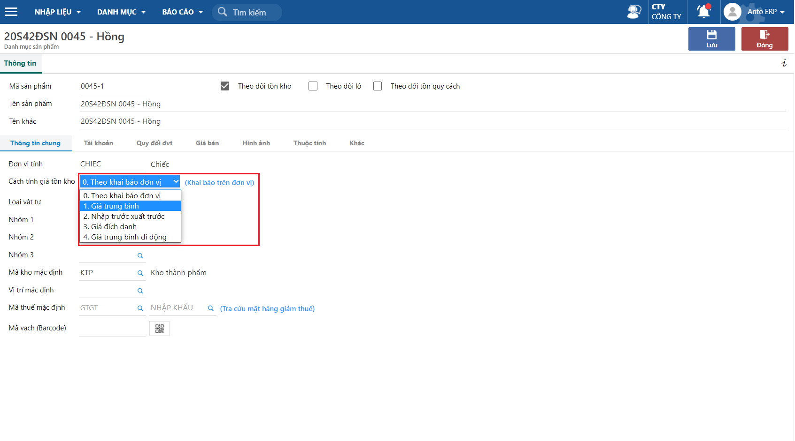

---
layout:
  title:
    visible: true
  description:
    visible: false
  tableOfContents:
    visible: true
  outline:
    visible: true
  pagination:
    visible: false
---

# \[DONE] Khai báo phương pháp tính giá

Mỗi một doanh nghiệp tùy vào đặc thù sản xuất kinh doanh của mình mà áp dụng phương pháp tính giá trị tồn kho, có thể lựa chọn các phương pháp tính giá sao cho thuận lợi trong quá trình tính toán nhưng phải sử dụng đúng nguyên tắc nhất quán trong hạch toán.

Các phương pháp tính giá hiện nay:

* [Phương pháp giá đích danh](done-tinh-gia-xuat-kho-theo-phuong-phap-thuc-te-dich-danh.md)
* [Phương pháp giá trung bình](done-tinh-gia-xuat-kho-theo-phuong-phap-trung-binh-thang.md)
* [Phương pháp giá trung bình di động](done-tinh-gia-xuat-kho-theo-phuong-phap-trung-binh-di-dong.md)
* [Phương pháp nhập trước, xuất trước](done-tinh-gia-xuat-kho-theo-phuong-phap-nhap-truoc-xuat-truoc-fifo.md)

Bài viết này giúp người sử dụng hiểu rõ cách thiết lập cách tính giá trên hệ thống phần mềm Arito

## Cách thiết lập phương pháp tính giá

### Bước 1: Khai báo phương tính giá theo đơn vị cơ sở

Thao tác này thường sẽ được cài đặt trong thời điểm đầu khi sử dụng phần mềm và có thể điều chỉnh trong quá trình sử dụng.

Đường dẫn: **Hệ thống/Phân quyền và giới hạn truy cập/Danh sách đơn vị chi nhánh**

<figure><figcaption>
Khai thông tin đơn vị cơ sở
</figcaption></figure>

Tại tab Thông tin khai báo chọn phương pháp tính giá theo nhu cầu tại trường **Cách tính giá tồn kho**

_**Lưu ý**_: Tính năng này chỉ các người dùng là quản trị hoặc được phân quyền thì mới có thể thao tác

### Bước 2: Khai báo phương pháp tính giá theo từng vật tư/sản phẩm

Tại bước này, phương pháp tính giá sẽ được khai báo chi tiết cho từng vật tư/sản phẩm.

Đường dẫn: **Phân hệ Tài chính/Danh mục/Vật tư, sản phẩm**

<figure><figcaption>
Khai báo phương pháp tính theo từng vật tư/sản phẩm
</figcaption></figure>

Nếu chọn phương pháp tính giá là **Theo khai báo đơn vị** thì hệ thống sẽ tính giá theo phương pháp đã khai báo ở Bước 1. Ngược lại sẽ tính theo phương pháp mà người dùng chọn

Lưu ý: Doanh nghiệp nên lựa chọn 1 phương pháp tính giá tồn kho phù hợp và khai báo thống nhất cho tất cả vật tư/sản phẩm
