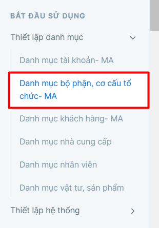

---
layout:
  title:
    visible: true
  description:
    visible: false
  tableOfContents:
    visible: true
  outline:
    visible: true
  pagination:
    visible: false
---

# Xuất kho NVL theo lệnh sản xuất

## Mô tả nghiệp vụ

Để sản xuất được thành phẩm hay bán thành phẩm thì cần xuất nguyên vật liệu đi sản xuất, để ghi nhận giảm tồn kho NVL. Các phiếu xuất nguyên vật liệu cũng là cơ sở để tính giá thành phẩm, bán thành phẩm.

## Định khoản

Nợ TK 621, 154&#x20;

Có TK 152, 153 Giá trị nguyên vật liệu, vật tư xuất kho

## Các bước thực hiện

Phiếu xuất kho nguyên vật liệu được thực hiện trên phần mềm như sau:

**Bước 1**: Vào phiếu xuất kho theo đường dẫn: _**Kho/ Nhập liệu/ Xuất kho nội bộ/ Phiếu xuất kho**_

**Bước 2**: Trên thanh công cụ nhấn nút **Thêm** để tạo mới 1 phiếu.

**Bước 3**: Kế thừa dữ liệu từ **Lệnh sản xuất** sau đó nhấn **Lưu** để lưu phiếu.

<figure><figcaption></figcaption></figure>

Dựa vào danh sách mã sản phẩm cần sản xuất ở Lệnh sản xuất, hệ thống sẽ tự động rã ra các nguyên vật liệu cần xuất kho dựa trên Định mức nguyên vật liệu đã khai báo cho các mã sản phẩm đó.

<figure><figcaption></figcaption></figure>

<figure><figcaption>
Màn hình phiếu xuất kho đã kế thừa dữ liệu
</figcaption></figure>

**Các thông tin cần lưu ý**:

* Mã đối tượng: Có thể định nghĩa đối tượng xuất kho sản xuất theo khách hàng trên đơn hàng cần sản xuất, theo phân xưởng hoặc theo mã đối tượng chung của doanh nghiệp.
* Thông tin vật tư: Chỉ cần nhập thông tin vật tư, kho và số lượng. Giá sẽ tự động áp khi thực hiện tính giá vốn hàng xuất kho trên phần mềm.&#x20;
* Lý do xuất: Đặt các mã lý do gợi nhớ cho nhân viên dưới kho (trường hợp người xuất kho là nhân viên kho, không rành về tài khoản kế toán) lựa chọn và tự load ra tài khoản nợ. Nếu phần mềm chỉ sử dụng cho kế toán nhập thì mã lý do chính là tài khoản nợ. Chương trình cho phép khai báo lý do xuất và tài khoản nợ mặc định theo loại giao dịch [tại đây](http://127.0.0.1:5000/s/rcD7ImF1NXzNzFohN8p5/cach-khai-bao-tai-khoan-ngam-dinh-theo-loai-giao-dich-tren-cac-chung-tu-kho).
* File đính kèm: Chương trình cho phép người dùng đính kèm file thuộc nhiều định dạng khác nhau.&#x20;

**Bước 4**: In phiếu bằng cách nhấn vào nút biểu tượng **In** trên chứng từ hoặc thanh công cụ.
