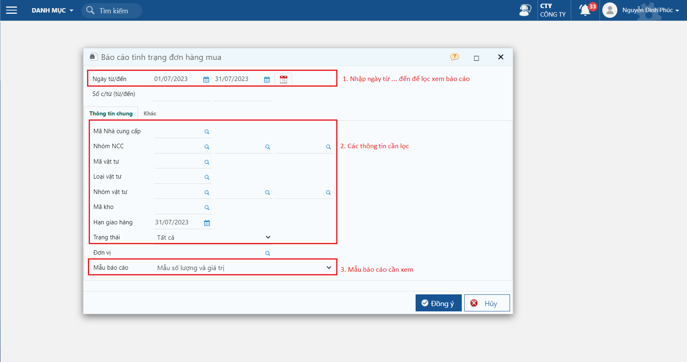
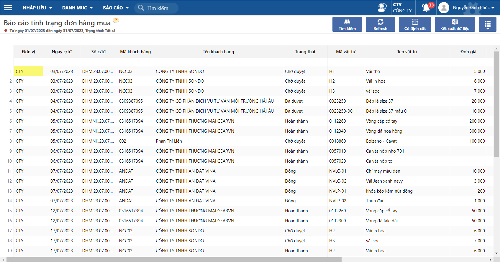

---
layout:
  title:
    visible: true
  description:
    visible: false
  tableOfContents:
    visible: true
  outline:
    visible: true
  pagination:
    visible: false
---

# \[DONE] Báo cáo theo dõi tình trạng đơn hàng mua

## Mô tả

Báo cáo dùng để theo dõi tình trạng của đơn hàng, số lượng đặt, số lượng đã nhập kho, số lượng nhà cung cấp đã xuất hoá đơn, số lượng trả lại nhà cung cấp,..&#x20;

## Các bước thực hiện

**Bước 1:** Truy cập báo cáo tại đường dẫn _**Mua hàng/ Báo cáo/ Tình trạng mua hàng/ Báo cáo tình trạng đơn mua hàng**_

**Bước 2:** Nhập các thông tin muốn xem tại màn hình lọc

<figure><figcaption>
Màn hình lọc
</figcaption></figure>

**Một số lưu ý:**

* Hạn giao hàng: Nếu theo dõi hạn giao hàng chi tiết trên đơn hàng, thì khi lọc theo hạn giao hàng, chương trình sẽ nhặt các đơn hàng có ngày giao <= ngày giao trên điều kiện lọc.
* Trạng thái: Lọc theo trạng thái thực hiện của đơn hàng.

**Bước 3:** Xem báo cáo và xuất excel bằng nút chức năng Kết xuất dữ liệu để xử lý.

<figure><figcaption>
Báo cáo theo dõi tình trạng đơn hàng mua
</figcaption></figure>
