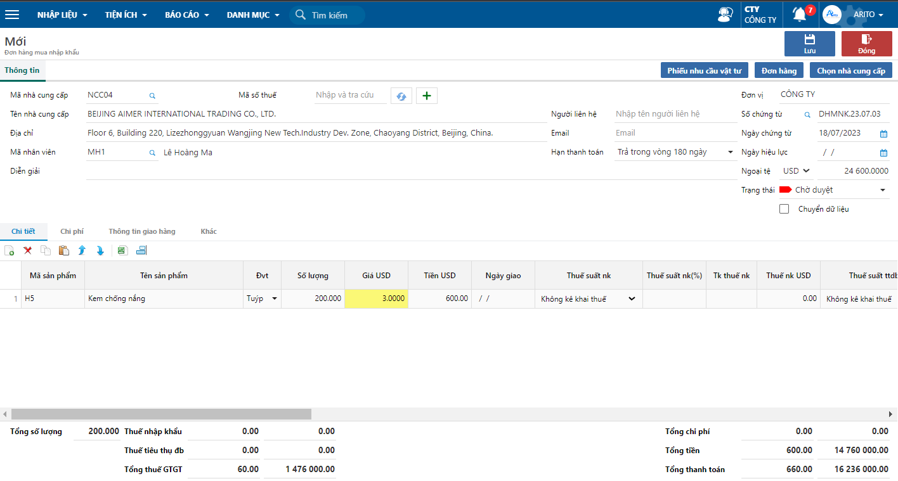

---
layout:
  title:
    visible: true
  description:
    visible: false
  tableOfContents:
    visible: true
  outline:
    visible: true
  pagination:
    visible: false
---

# \[DONE] Lập đơn hàng mua nhập khẩu

## Mô tả nghiệp vụ

Cập nhật đơn hàng mua hàng hóa nhập khẩu của nhà cung cấp nước ngoài. Đơn hàng nhập khẩu khác đơn hàng mua trong nước ở các đầu mục liên quan đến thuế nhập khẩu, thuế tiêu thụ đặc biệt.

## **Các bước thực hiện**

Đơn hàng mua nhập khẩu được thực hiện trên phần mềm như sau:

**Bước 1**: Vào đơn hàng mua nhập khẩu theo đường dẫn: **Mua hàng/ Nhập liệu/ Đơn đặt hàng/ Đơn hàng nhập khẩu**

**Bước 2:** Trên thanh công cụ nhấn nút **Thêm** để tạo mới 1 phiếu.

**Bước 3:** Nhập các thông tin trên phiếu, sau đó nhấn **Lưu** để lưu phiếu.

<figure><figcaption>
Lập đơn hàng nhập khẩu
</figcaption></figure>

**Các thông tin cần lưu ý:**

* Mã nhà cung cấp: Khi nhập mã nhà cung cấp chương trình sẽ hiện các thông tin chung như đã khai báo (Hướng dẫn khai báo mã nhà cung cấp [tại đây](http://127.0.0.1:5000/s/uQIjY7kVhyePdTM2Jf1L/mua-hang/tao-thong-tin-nha-cung-cap)).
* Chọn mã ngoại tệ, tỷ giá tại thời điểm lên đơn hàng.
* Thông tin vật tư: cần nhập mã vật tư, số lượng và giá.&#x20;
* Chọn mã thuế nhập khẩu, thuế TTĐB, thuế GTGT (nếu có).
* Chọn ngày giao (nếu có): Ngày dự kiến giao hàng của nhà cung cấp. Nếu hàng hóa tách thành nhiều đợt giao thì tách dòng trên đơn hàng để theo dõi chi tiết đợt giao hàng.
* Đơn hàng mặc định lưu ở trạng thái Chờ duyệt.
