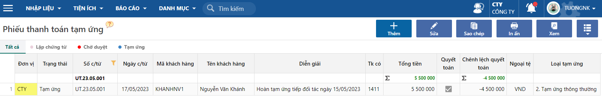
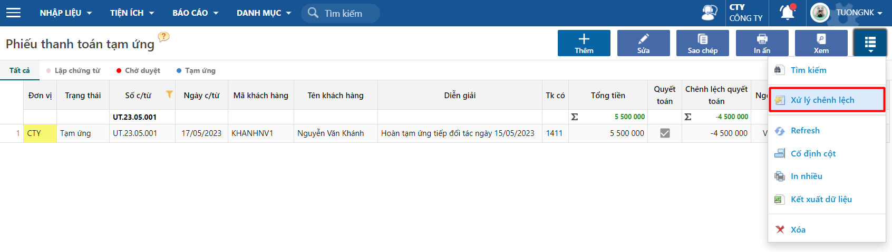
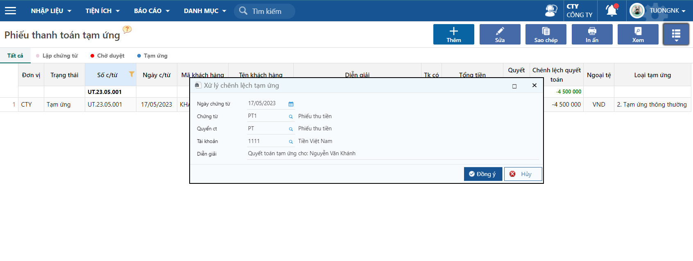
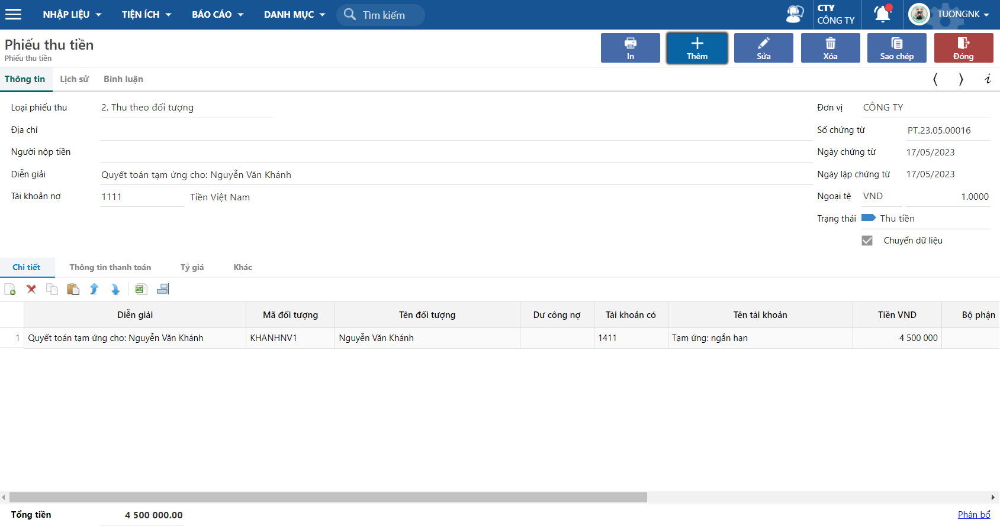

---
layout:
  title:
    visible: true
  description:
    visible: false
  tableOfContents:
    visible: true
  outline:
    visible: true
  pagination:
    visible: false
---

# \[DONE] Quy trình theo dõi thanh toán tạm ứng

## Mô tả nghiệp vụ

Tài liệu mô tả các thao tác chi tiền tạm ứng, quyết toán các lần tạm ứng, theo dõi số dư tạm ứng của nhân viên.

Có thể theo dõi thanh toán cho chi phí hoặc mua hàng cấn trừ công nợ với tạm ứng nhân viên.

## Hướng dẫn thao tác

### Chi tiền theo đề nghị tạm ứng nhân viên

Đường dẫn:

* _**Tiền mặt/ Nhập liệu/ Phiếu chi.**_
* _**Tiền gửi/ Nhập liệu/ Giấy báo nợ.**_

Người dùng làm chứng từ chi tiền, chi theo đối tượng để ghi nhận chi tiền cho nhân viên.

* Hạch toán: Nợ 141x/ Có 111x.

<figure><figcaption>
Màn hình nhập liệu Phiếu chi.
</figcaption></figure>

### Tập hợp chứng từ thanh toán tạm ứng

#### Tạm ứng thông thường

Dùng trong trường hợp thanh toán tạm ứng cho nhân viên đi công tác, tiếp khách,...

Đường dẫn: _**Mua hàng/ Nhập liệu/ Phiếu thanh toán tạm ứng.**_

* Hạch toán: Nợ 641x/Có 141x (thông thường tài khoản nợ sẽ cho tài khoản chi phí).

<figure><figcaption>
Phiếu thanh toán tạm ứng thông thường.
</figcaption></figure>

#### Tạm ứng cấn trừ công nợ

Dùng trong trường hợp thanh toán tạm ứng cho nhân viên đi mua hàng của nhà cung cấp, lúc này sẽ cấn trừ phần tạm ứng của nhân viên với công nợ của nhà cung cấp.

* Hạch toán: Nợ 331x/Có 141x.

<figure><figcaption>
Phiếu thanh toán tạm ứng cấn trừ công nợ.
</figcaption></figure>

### Quyết toán tạm ứng

Trường hợp có chênh lệch giữa số tiền tạm ứng và thanh toán tạm ứng, người dùng có thể sử dụng chức năng Xử lý chênh lệch để quyết toán tạm ứng.

* Trường hợp số tiền hoàn ứng nhỏ hơn số tiền thanh toán tạm ứng-> tạo phiếu thu/giấy báo có tùy số tiền nhân viên hoàn trả lại cho doanh nghiệp, theo hình thức tiền mặt hoặc chuyển khoản.
* Trường hợp số tiền hoàn ứng lớn hơn số tiền thanh toán tạm ứng -> tạo phiếu chi/giấy báo nợ tùy vào số tiền doanh nghiệp chi thêm để trả cho nhân viên theo hình thức tiền mặt hoặc chuyển khoản.

**Thao tác quyết toán**

**Bước 1:** Tick vào checkbox **Quyết toán các lần tạm ứng** ở góc phải màn hình chứng từ, chương trình sẽ bung thêm tab thông tin Quyết toán các lần tạm ứng.

<figure><figcaption></figcaption></figure>

**Bước 2:** Tại tab quyết toán các lần tạm ứng người dùng chọn phiếu chi/giấy báo nợ, đã chi tiền tạm ứng trước đó để quyết toán, có thể chọn 1 hoặc nhiều phiếu chi/giấy báo nợ để quyết toán

<figure><figcaption></figcaption></figure>

**Bước 3:** Sau khi chọn được chứng từ chi để quyết toán, người dùng bấm lưu phiếu thanh toán tạm ứng, chương trình sẽ tính các chênh lệch quyết toán.

<figure><figcaption>
Bước 3. Xem chênh lệch.
</figcaption></figure>

**Bước 4:** Ở góc trên bên phải màn hình, người dùng bấm chọn xử lý chênh lệch.

<figure><figcaption>
Bước 4.Xử lý chênh lệch.
</figcaption></figure>

**Bước 5:** Sau khi bấm chọn xử lý chênh lệch, chương trình sẽ bung màn hình chọn chứng từ xử lý, người dùng chọn các thông tin cần tạo tương ứng.

<figure><figcaption>
Bước 5. Nhập liệu xử lý chênh lệch.
</figcaption></figure>

**Bước 6:** Sau khi đã điền đầy đủ thông tin bấm đồng ý, chương trình sẽ tạo một chứng từ tương ứng người dùng đã chọn. Người dùng có thể bấm vào chứng từ quyết toán để xem phiếu đã tạo.

<figure><figcaption>
Bước 6. Kiểm chứng từ đã tạo.
</figcaption></figure>

### Các báo cáo liên quan

**Báo cáo Sổ chi tiết công nợ theo khách hàng**

Đường dẫn: _**Bán hàng/Báo cáo/Sổ chi tiết công nợ theo khách hàng.**_

Tài khoản 141, Tạm ứng nhân viên.

<figure><figcaption>
Sổ chi tiết công nợ khách hàng.
</figcaption></figure>

## Theo dõi tuổi nợ khoản tạm ứng

### Công nợ hóa đơn theo nhân viên

Trường hợp doanh nghiệp có nhu cầu theo dõi chứng từ chi tiền tạm ứng như một hóa đơn cần theo dõi tuổi nợ của khoản tạm ứng, trên chứng từ chi tiền, người dùng tick vào theo dõi thanh toán.

<figure><figcaption>
Màn hình nhập liệu phiếu chi tiền.
</figcaption></figure>

Khi tick vào theo dõi thanh toán, phiếu chi này được xem như một hóa đơn phải trả và có thể theo dõi tình trạng thanh toán, nếu có quy định về thời gian hoàn ứng thì người dùng khai báo mã thanh toán thời hạn hoàn ứng, chương trình sẽ lấy số phiếu chi làm số chứng từ theo dõi.

**Báo cáo Công nợ theo hóa đơn**

Đường dẫn: _**Bán hàng/ Báo cáo/ Công nợ theo hóa đơn.**_

<figure><figcaption>
Bảng kê công nợ hóa đơn bán.
</figcaption></figure>

Tại báo cáo này người dùng có thể kiểm tra được phần hoàn ứng theo từng lần của nhân viên, trường hợp vẫn còn công nợ phải thu theo hóa đơn, nhưng tài khoản công nợ 141 đã bằng 0, người dùng có thể sử dụng chứ năng phân bổ, để bổ giá trị thu hoàn ứng cho hóa đơn này.

**Thao tác phân bổ**

Tham khảo thao tác phân bổ thu tiền cho hóa đơn[ tại đây](../quan-ly-tuoi-no-hoa-don/18\_doi-tru-chung-tu-cong-no-cua-nha-cung-cap.md)

Sau khi lưu phân bổ, chương trình sẽ tất toán hóa đơn, người dùng có thể xem báo cáo công nợ theo hóa đơn để kiểm tra.

<figure><figcaption>
Bước 3: Xem Bảng kê công nợ hóa đơn bán.
</figcaption></figure>
