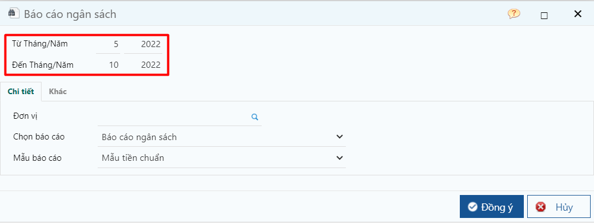
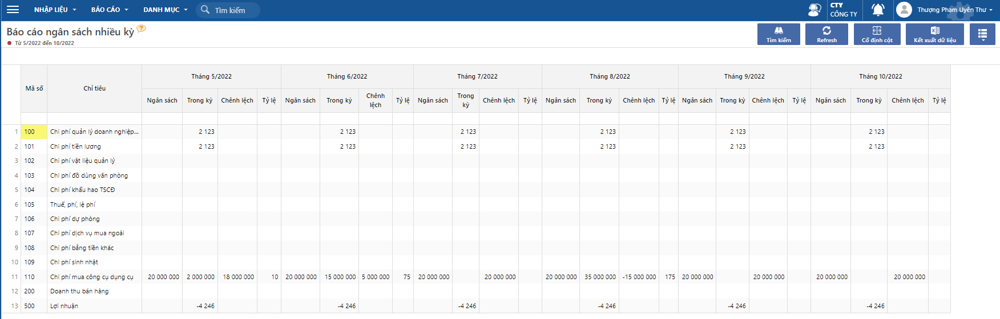

---
layout:
  title:
    visible: true
  description:
    visible: false
  tableOfContents:
    visible: true
  outline:
    visible: true
  pagination:
    visible: false
---

# Báo cáo ngân sách nhiều kỳ

Báo cáo xem tình hình thực hiện các chỉ tiêu ngân sách thực tế so với dự toán xoay theo các tháng trong năm. Người dùng có thể so sánh được tình hình thực hiện của 1 chỉ tiêu theo các tháng trong năm để biết tháng nào hiệu quả/tháng nào sử dụng chi phí vượt ngân sách nhiều.&#x20;

* Đường dẫn: _**Ngân sách/ Báo cáo/ Báo cáo ngân sách nhiều kỳ**_

<figure><figcaption>
Màn hình lọc
</figcaption></figure>

<figure><figcaption>
Màn hình báo cáo
</figcaption></figure>

**Báo cáo thể hiện các chỉ tiêu sau:**

* Mã chỉ tiêu: dùng để theo dõi các mẫu báo cáo
* Ngân sách: số dự đoán của chỉ tiêu ngân sách lấy từ màn hình Cập nhật dự toán ngân sách
* Trong kỳ: Số thực hiện/ phát sinh trong tháng tại thời điểm lọc báo cáo
* Chênh lệch: Bằng số ngân sách – thực hiện, để biết đã phát sinh chi phí vượt quá ngân sách hay chưa, nếu vượt thì vượt bao nhiều tiên.
* Tỷ lệ = Thực hiện/ Ngân sách \*100 (dùng để so sánh tỷ lệ thực với tỷ lệ dự toán)
