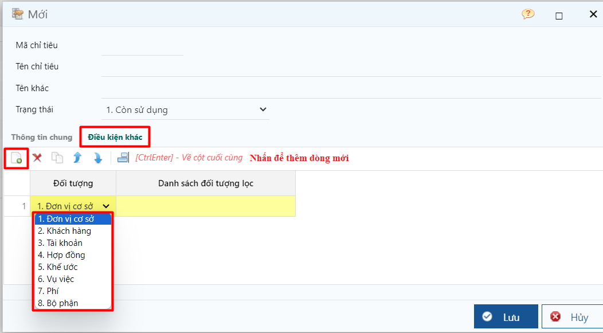

---
layout:
  title:
    visible: true
  description:
    visible: false
  tableOfContents:
    visible: true
  outline:
    visible: true
  pagination:
    visible: false
---

# Quy trình theo dõi ngân sách

Dự toán ngân sách

* Cập nhật dự toán theo từng chỉ tiêu ngân sách trong kỳ kế toán.
* Xem báo cáo so sánh chi tiêu thực tế với ngân sách dự toán: từng kỳ hoặc nhiều kỳ.

## Các bước thực hiện

**Bước 1.** Khai báo các chỉ tiêu chi phí cần theo dõi dự toán trong doanh nghiệp theo đường dẫn _**Kế toán/ Ngân sách/ Danh mục chỉ tiêu ngân sách**_

Có thể khai báo chỉ tiêu này theo tài khoản kế toán hoặc các đối tượng như mã phí, bộ phận, vụ việc, hợp đồng, khách hàng,…

<figure><figcaption>
Danh mục chỉ tiêu ngân sách
</figcaption></figure>

<figure><figcaption></figcaption></figure>

**Bước 2.** Cập nhật dự toán ngân sách theo ường dẫn: _**Kế toán/ Ngân sách/ Cập nhật dự toán ngân sách**_

* Cập nhật ngân sách kế hoạch cho từng kỳ kế toán.
* Có thể cập nhật cho từng đơn vị cơ sở, bộ phận phòng ban, dự án.

<figure><figcaption>
Màn hình lọc
</figcaption></figure>

<figure><figcaption>
Màn hình cập nhật
</figcaption></figure>

**Bước 3.** Cập nhật đề nghị chi theo đường dẫn: _**Kế toán/ Tiền mặt (Tiền gửi)/ Đề nghị thanh toán**_

* Chứng từ dùng để cập nhật các khoản chi phát sinh cần được xét duyệt. Tại màn hình này có thể chọn khoản chi này thuộc chỉ tiêu ngân sách nào để biết tại thời điểm lập đề nghị, ngân sách khả dụng của khoản này còn bao nhiêu để duyệt chi.

<figure><figcaption>
Đề nghị chi
</figcaption></figure>

**Bước 4.** Tạo chứng từ chi

Sau khi đề nghị chi được duyệt, kế toán sẽ lập các phiếu chi tiền mặt hoặc giấy báo nợ ngân hàng kế thừa dữ liệu từ đề nghị chi này.

Đường dẫn: _**Đường dẫn: Kế toán/ Tiền mặt (Tiền gửi)/ Phiếu chi (Giấy báo nợ)**_

<figure><figcaption></figcaption></figure>

Màn hình sau khi kế thừa

<figure><figcaption></figcaption></figure>

**Bước 5.** Xem báo cáo

Hướng dẫn xem báo cáo [tại đây](bao-cao-5/)

