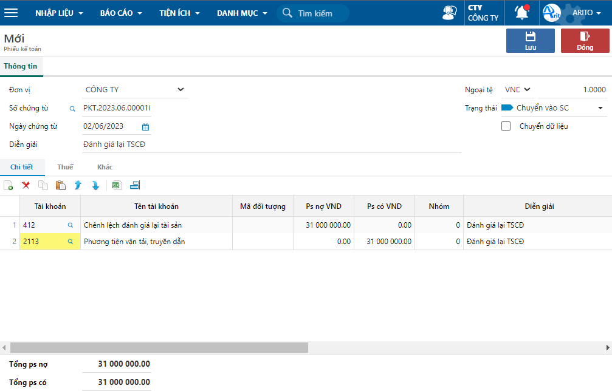

---
layout:
  title:
    visible: true
  description:
    visible: false
  tableOfContents:
    visible: true
  outline:
    visible: true
  pagination:
    visible: false
---

# \[DONE] Điều chỉnh giảm giá trị tài sản cố định

## Mô tả nghiệp vụ

Dùng để điều chỉnh giá trị TSCĐ (nếu có) trong các trường hợp như: đánh giá lại tài sản, tháo dỡ làm thay đổi giá trị TSCĐ,…

Khi điều chỉnh giảm, phần giảm sẽ được trừ bớt vào giá trị còn lại của tài sản và phân bổ cho số kỳ khấu hao còn lại.

## Định khoản

**Trường hợp đánh giá lại tài sản, điều chỉnh giảm**

Nợ TK 412 Chênh lệch đánh giá lại tài sản

Nợ TK 214 Hao mòn TSCĐ

Có TK 211, 213, 217

**Trường hợp TSCĐ bị tháo dỡ**

Nợ TK 153 Công cụ dụng cụ

Nợ TK 811 Chi phí khác

Có TK 211 TSCĐ hữu hình

## Các bước thực hiện

**Bước 1:** Lập chứng từ điều chỉnh:&#x20;

Phiếu kế toán: _**Tổng hợp/ Nhập liệu/ Hạch toán/ Phiếu kế toán.**_ Dùng trong trường hợp đánh giá lại tài sản, tháo dỡ phụ tùng,...

<figure><figcaption></figcaption></figure>

**Bước 2:** Vào màn hình điều chỉnh theo đường dẫn: _**Tài sản/ Khai báo tăng/giảm TSCĐ/ Điều chỉnh TSCĐ.**_

**Bước 3:** Nhập điều kiện lọc mã điều chỉnh.

Có thể không nhập điều kiện lọc thì sẽ hiện tất cả mã điều chỉnh.

<figure><figcaption>
Nhập điều kiện lọc 
</figcaption></figure>

**Bước 4:** Chọn nút **Thêm** trên thanh công cụ để thêm mới phiếu.

**Bước 5:** Nhập các thông tin trên phiếu và nhấn **Lưu**.

<figure><figcaption></figcaption></figure>

**Các thông tin cần lưu ý:**

* Khi chọn mã tài sản, chương trình sẽ hiện số kỳ khấu hao còn lại.
* Chọn mã lý do giảm và nhập kỳ, ngày thay đổi, mã chứng từ liên quan.
* Số chứng từ: Nhập số chứng từ liên quan.
* Nguyên giá: là giá trị điều chỉnh giảm. Sau khi nhập nguyên giá, chương trình sẽ tính giá trị khấu hao điều chỉnh (giá trị khấu hao phần giảm) và giá trị khấu hao sau điều chỉnh (giá trị khấu hao trước khi điều chỉnh - giá trị khấu hao điều chỉnh).

**Ví dụ:**

* Tài sản: Xe xúc đất có nguyên giá 900.000.000đ. Ngày bắt đầu tính khấu hao là ngày 05/01/2020.
  * Số kỳ khấu hao 72 tháng
  * Giá trị khấu hao 1 kỳ là 12.500.000đ.&#x20;
* Tại thời điểm điều chỉnh ngày 02/06/2023.
  * Số kỳ khấu hao còn lại là 31 tháng, giá trị điều chỉnh giảm là 31.000.000đ.
  * Giá trị khấu hao điều chỉnh 1 kỳ = 31.000.000 / 31 = 1.000.000
  * \=> Giá trị khấu hao sau điều chỉnh = 12.500.000 - 1.000.000 = 11.500.000
