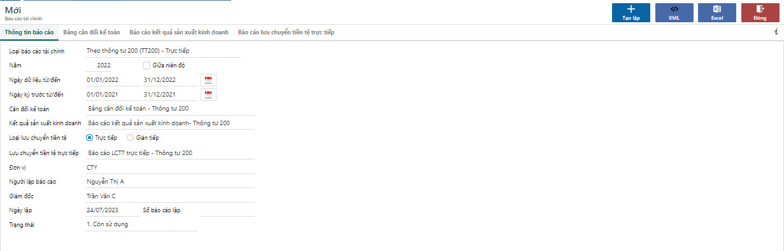

---
layout:
  title:
    visible: true
  description:
    visible: false
  tableOfContents:
    visible: true
  outline:
    visible: true
  pagination:
    visible: false
---

# \[DONE] Lập và nộp báo cáo tài chính

## Mô tả

Khi quyết toán năm, kế toán cần tạo lập các báo cáo tài chính theo quy định để nộp thuế. Ngoài việc lập trên hệ thống HTKK thì phần mềm hỗ trợ việc tạo lập và xuất file XML cho các báo cáo này.

## Các bước thực hiện

### Lập báo cáo tài chính

**Bước 1**: Truy cập chức năng tại đường dẫn **Thuế/ Nhập liệu/ Lập báo cáo tài chính** để lập báo cáo tài chính từ các báo cáo tài chính đã kiểm tra ở phân hệ Tổng hợp.

**Bước 2**: Chọn loại BCTC, niên độ, bộ BCTC theo thông tư, và các thông tin đơn vị, người lập, giám đốc, sau đó bấm lưu.

<figure><figcaption></figcaption></figure>

**Bước 3**: Bấm **Tạo lập** để lập bộ BCTC theo các cáo cáo đã chọn ở điều kiện lọc.

**Bước 4**: Kiểm tra các báo cáo tài chính đã được tạo lập tại từng tab, nếu có điều chỉnh thì nhấn nút chức năng **Sửa** để cập nhật và lưu thông tin điều chỉnh.

<figure><figcaption></figcaption></figure>

**Lưu ý**: Nếu báo cáo tài chính đã lập và chưa nộp nhưng có nhiều sai sót cần lập lại, người dùng có thể xóa để tạo lập lại.

### Kết xuất tờ khai XML

Chọn nút **XML** để kết xuất file BCTC XML&#x20;

<figure><figcaption></figcaption></figure>

### Nộp báo cáo tài chính

Sau khi tải file XML HTKK từ phần mềm, người dùng vào trang [thuedientu.gdt.gov.vn](https://thuedientu.gdt.gov.vn/) tải file XML lên, ký và nộp báo cáo tài chính.
