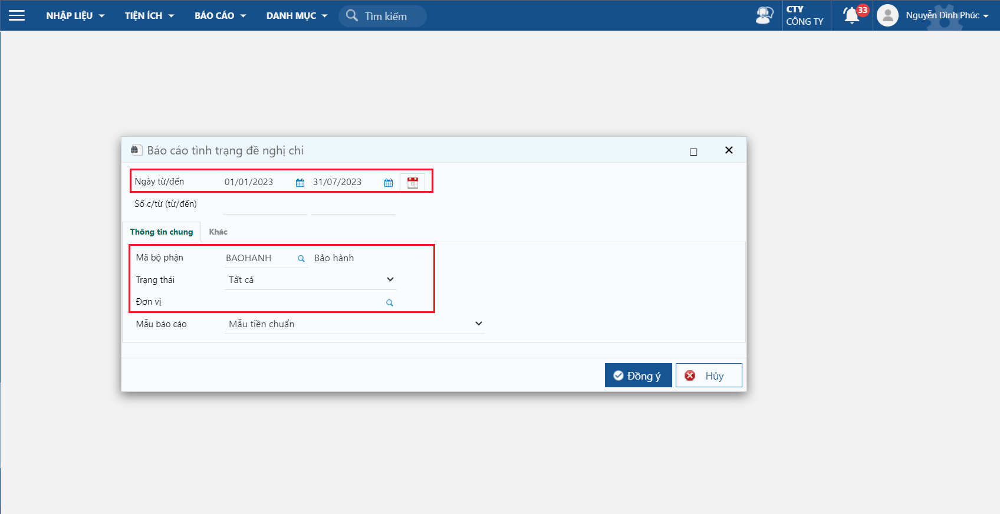

# Báo cáo tình trạng đề nghị thanh toán

## Mô tả nghiệp vụ

Dùng để theo dõi tình hình chi tiền theo đề nghị thanh toán

## Hướng dẫn thao tác

**Bước 1:** Vào đường dẫn _**Tiền mặt/ Báo cáo/ Báo cáo tình trạng đề nghị thanh toán**_

**Bước 2:** Nhập thông tin màn hình điều kiện lọc và nhấn **Đồng ý**

<figure><figcaption>
Màn hình lọc
</figcaption></figure>

**Các thông tin cần lưu ý:**

* Ngày từ/ đến: khoảng thời gian lọc theo đề nghị thanh toán
* Số chứng từ: nhập số đề nghị cần lọc, để trống sẽ lấy hết các chứng từ
* Mã bộ phận
* Trạng thái: trạng thái của đề nghị thanh toán

<figure><figcaption>
Thông tin báo cáo
</figcaption></figure>

* Báo cáo theo dõi tình trạng của đề nghị chi như số chứng từ, ngày chứng từ, số tiền đề nghị, số tiền kế toán đã chi và số tiền còn lại

**Bước 3:** Khi cần in báo cáo, nhấn nút **In ấn** và chọn mẫu cần in
