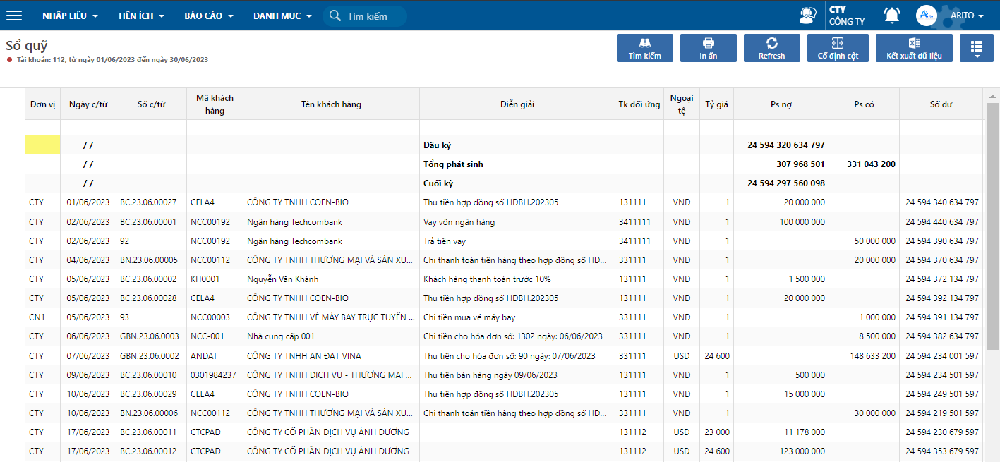
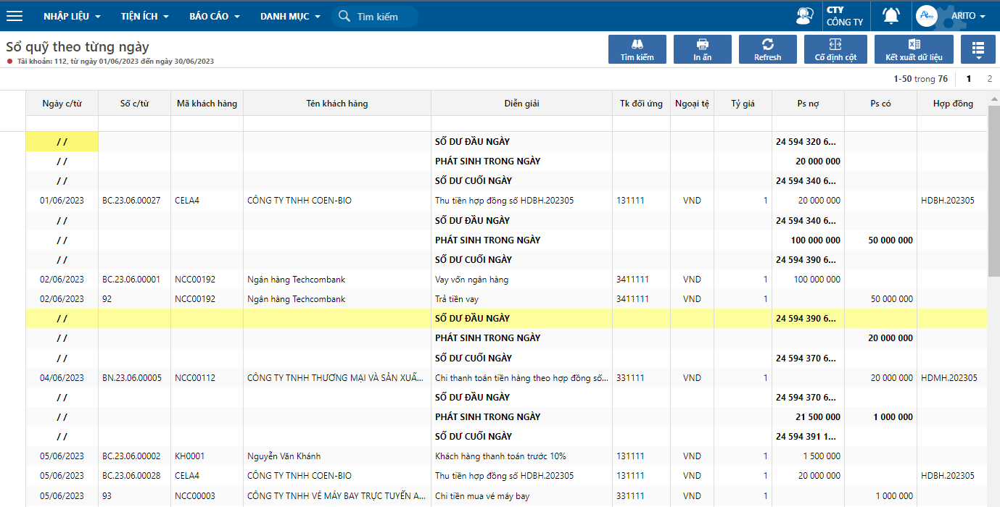

---
layout:
  title:
    visible: true
  description:
    visible: false
  tableOfContents:
    visible: true
  outline:
    visible: true
  pagination:
    visible: false
---

# Sổ quỹ và Sổ quỹ in từng ngày

## Mô tả nghiệp vụ

Báo cáo theo dõi chi tiết các phát sinh liên quan đến tài khoản tiền, người dùng có thể theo dõi tồn quỹ đầu kỳ, các phát sinh và dư quỹ trong khoảng thời gian của điều kiện lọc.

Đối với sổ quỹ in từng ngày, người dùng có thể theo dõi chi tiết nhóm theo từng ngày.

## Hướng dẫn thao tác

**Bước 1:** Vào đường dẫn Tiền mặt/ Báo cáo/ Sổ quỹ- Sổ quỹ in từng ngày

**Bước 2:** Nhập điều kiện lọc báo cáo, nhấn **Đồng ý**

<figure><figcaption>
Nhập điều kiện lọc
</figcaption></figure>

* Tài khoản: tài khoản tiền
* Từ ngày đến ngày: khoảng thời gian lọc
* Ngày mở sổ: ngày thực hiện xem sổ, hiển thị trên mẫu in báo cáo
* Phân loại: Chi tiết (theo chi tiết phát sinh), nhóm theo tài khoản đối ứng, nhóm theo chứng từ (Báo nợ, báo có, phiếu thu, phiếu chi)

**Bước 3:** Theo dõi thông tin báo cáo

<figure><figcaption>
Sổ quỹ
</figcaption></figure>

<figure><figcaption>
Sổ quỹ theo từng ngày
</figcaption></figure>

**Bước 4:** Nếu muốn in báo cáo, trên thanh công cụ nhấn **In ấn** và chọn mẫu cần in

