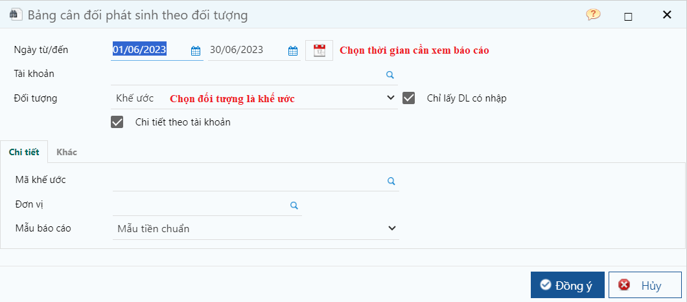
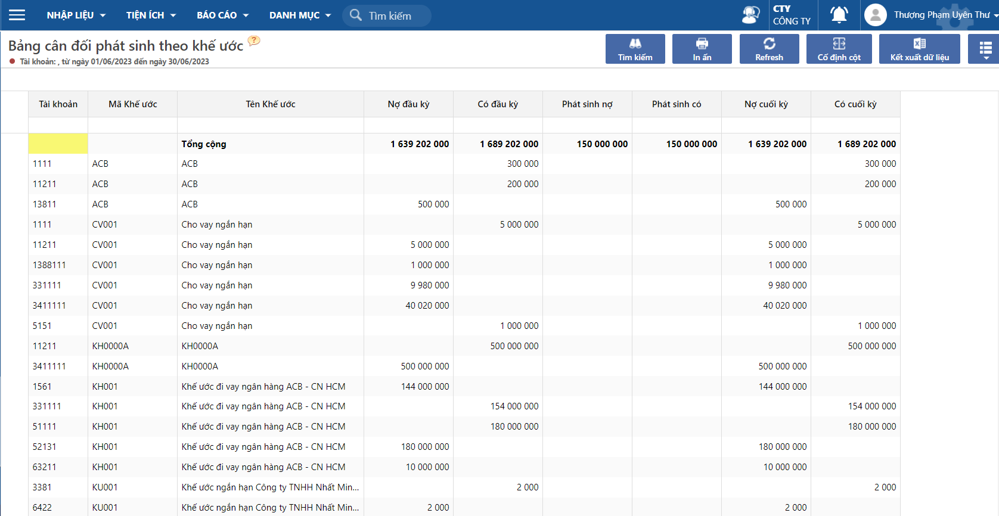

---
layout:
  title:
    visible: true
  description:
    visible: false
  tableOfContents:
    visible: true
  outline:
    visible: true
  pagination:
    visible: false
---

# Bảng cân đối phát sinh theo khế ước

Dùng để xem tình hình phát sinh của các khế ước dưới dạng bảng cân đối, bao gồm: số dư đầu kỳ, số phát sinh trong kỳ và số dư cuối kỳ của các khế ước.

Đường dẫn: **Báo cáo/ Tiền vay/ Bảng cân đối phát sinh theo khế ước**

<figure><figcaption>
Màn hình lọc
</figcaption></figure>

<figure><figcaption>
Thông tin báo cáo
</figcaption></figure>
