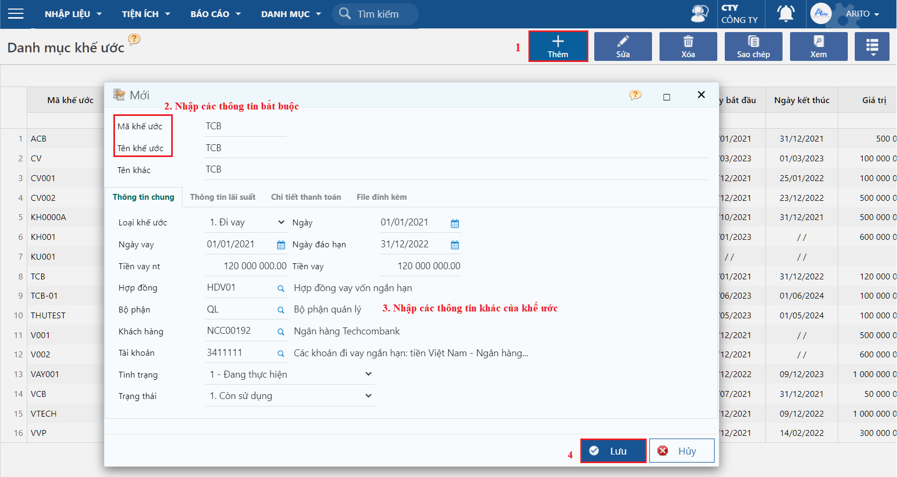
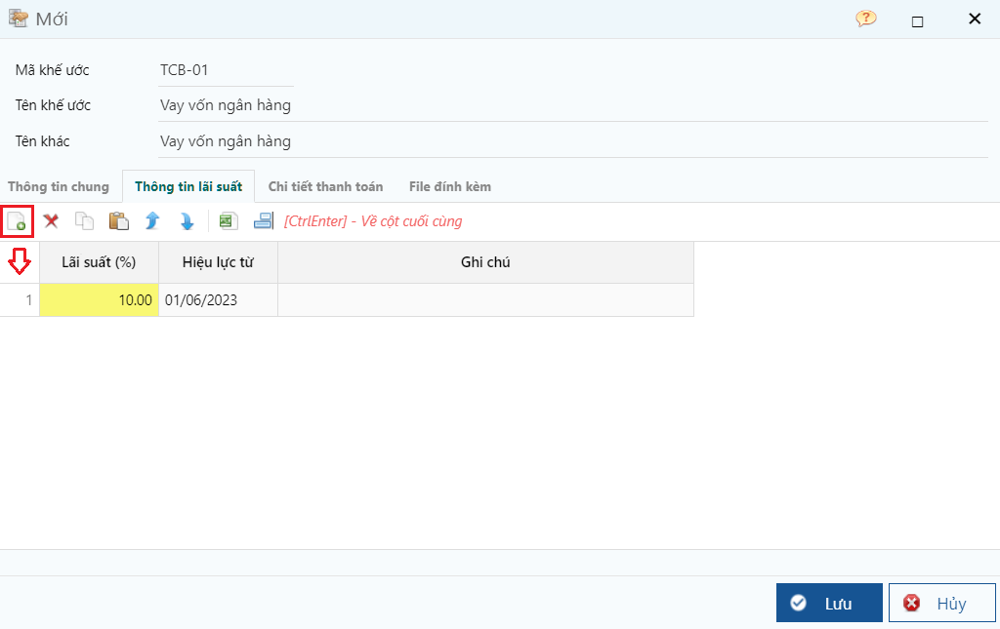
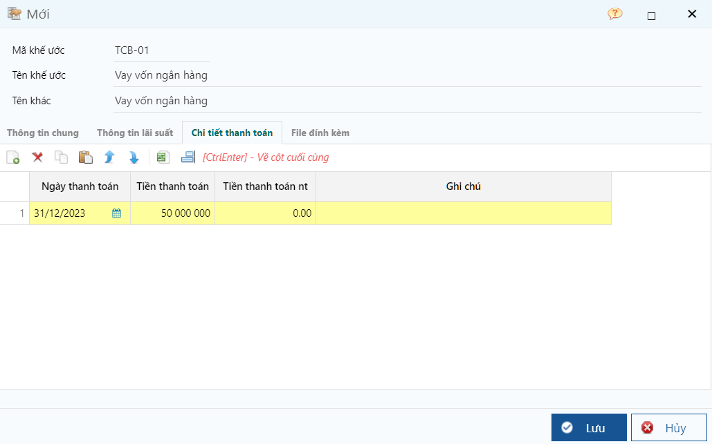

---
layout:
  title:
    visible: true
  description:
    visible: false
  tableOfContents:
    visible: true
  outline:
    visible: true
  pagination:
    visible: false
---

# \[DONE] Khai báo thông tin khế ước vay

## Mô tả nghiệp vụ

Dùng để khai báo thông tin các khế ước đi vay và cho vay cần theo dõi và quản lý. Mã khế ước sẽ được chỉ định trên chứng từ liên quan nhằm mục đích theo dõi phát sinh, báo cáo...

## Các bước thực hiện

**Bước 1:** Vào đường dẫn **Tiền gửi/Danh mục/Đối tượng/Khế ước.**

**Bước 2:** Trên thanh công cụ, nhấn **Thêm** để tạo mới.

<figure><figcaption>
Màn hình khai báo thông tin khế ước
</figcaption></figure>

**Các thông tin cần lưu ý:**

* Khai báo thông tin chính: mã khế ước, tên khế ước, loại khế ước, ngày vay, Tiền vay, Khách hàng, Tài khoản.
* Khai báo tab Thông tin lãi suất: theo dõi sự thay đổi về lãi suất vay theo khoản thời gian

<figure><figcaption>
Tab thông tin lãi suất
</figcaption></figure>

* Khai báo tab Chi tiết thanh toán: theo dõi các đợt thanh toán của khoản vay

<figure><figcaption>
Tab Chi tiết thanh toán
</figcaption></figure>

**Bước 3**: Nhấn **Lưu**.
