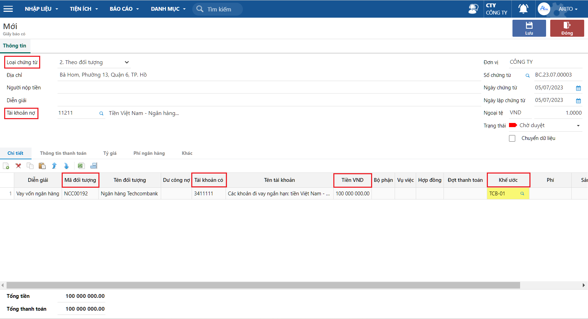
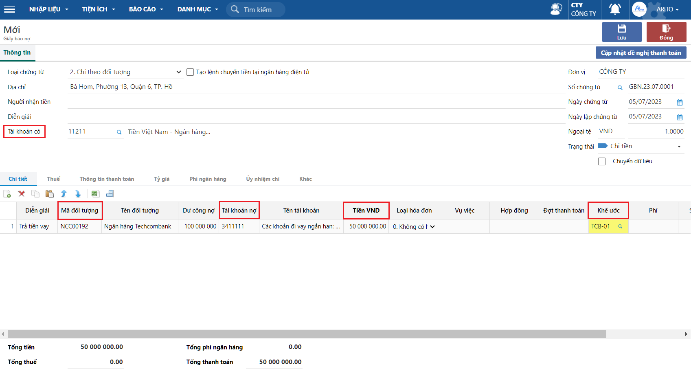

---
layout:
  title:
    visible: true
  description:
    visible: false
  tableOfContents:
    visible: true
  outline:
    visible: true
  pagination:
    visible: false
---

# \[DONE] Theo dõi thanh toán theo khế ước vay

## Mô tả nghiệp vụ

Tài liệu hướng dẫn các thao tác khi phát sinh các giao dịch chứng từ liên quan để khế ước vay. Ngoài ra ghi nhận các khoản thu tiền, chi tiền thanh toán theo khế ước.

## Các bước thực hiện

### Khai báo danh mục khế ước

Xem cách khai báo khế ước [tại đây](done-khai-bao-thong-tin-khe-uoc-vay.md).

### Thu tiền khi tiền về theo khế ước vay

**Bước 1:** Vào đường dẫn _**Tiền gửi/Nhập liệu/Hạch toán/Giấy báo có**_

**Bước 2:** Trên thanh công cụ nhấn nút **Thêm** để tạo mới phiếu

**Bước 3:** Chọn Loại phiếu thu: **2. Thu theo đối tượng**

<figure><figcaption></figcaption></figure>

* Khai báo các thông tin chung: địa chỉ, người nhận tiền, diễn giải, tài khoản nợ, số chứng từ, ngày hạch toán, trạng thái, …
* Khai báo thông tin tab Chi tiết: tài khoản nợ, mã khách công nợ, số tiền, …
* Chọn **mã khế ước** ở cột khế ước phục vụ tổng hợp dữ liệu lên báo cáo.

### Chi tiền thanh toán theo khế ước vay

**Bước 1:** Vào đường dẫn _**Tiền gửi/Nhập liệu/Hạch toán/Giấy báo nợ**_

**Bước 2:** Trên thanh công cụ nhấn nút **Thêm** để tạo mới phiếu

<figure><figcaption></figcaption></figure>

**Bước 3:** Chọn Loại phiếu chi: **2. Chi theo đối tượng**

* Khai báo các thông tin chung: địa chỉ, người nhận tiền, diễn giải, tài khoản có, số chứng từ, ngày hạch toán, trạng thái, …
* Khai báo thông tin tab Chi tiết: tài khoản có, mã khách công nợ, số tiền, …
* Chọn **mã khế ước** ở cột khế ước phục vụ tổng hợp dữ liệu lên báo cáo.

###

