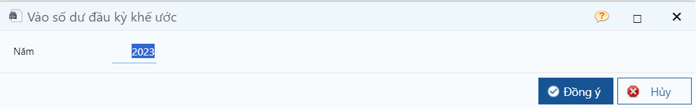
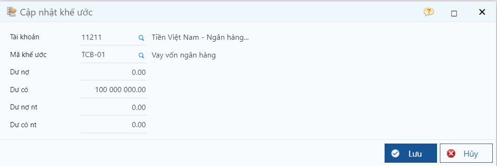

---
layout:
  title:
    visible: true
  description:
    visible: false
  tableOfContents:
    visible: true
  outline:
    visible: true
  pagination:
    visible: false
---

# \[DONE] Vào số dư đầu kỳ theo khế ước vay

## Mô tả nghiệp vụ

Dùng để cập nhật số dư các khoản vay đến thời điểm bắt đầu sử dụng hệ thống.

## Các bước thực hiện

**Bước 1**: Vào đường dẫn _**Tổng hợp/ Nhập liệu/ Đầu kỳ/ Vào số dư đầu kỳ khế ước**_

**Bước 2:** Chọn năm bắt đầu đưa dữ liệu số dư đầu kỳ, rồi bấm **Nhận**.

<figure><figcaption>
Màn hình lọc
</figcaption></figure>

**Bước 3:** Trên thanh công cụ, nhấn **Thêm** để thêm mới

**Bước 4:** Nhập thông tin và nhấn **Lưu** Chọn biểu tượng Thêm trên thanh công cụ để cập nhật số dư, và khai báo các thông tin về tài khoản, khế ước, số dư ngoại tệ và nguyên tệ.

<figure><figcaption>
Màn hình cập nhật khế ước đầu kỳ
</figcaption></figure>

**Các thông tin cần lưu ý:**

* Chọn mã khế ước được cập nhật trong Danh mục khế ước
* Khai báo các thông tin về tài khoản, số dư ngoại tệ và nguyên tệ.

**Lưu ý:** Hệ thống hỗ trợ import dữ liệu đầu kỳ từ excel vào, tham khảo cách import [tại đây](http://127.0.0.1:5000/s/rcD7ImF1NXzNzFohN8p5/import-du-lieu-tu-excel-vao-chuong-trinh).
