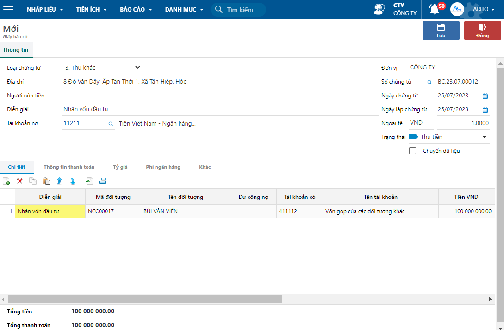

---
layout:
  title:
    visible: true
  description:
    visible: false
  tableOfContents:
    visible: true
  outline:
    visible: true
  pagination:
    visible: false
---

# \[Done] Thu khác bằng tiền gửi ngân hàng

## Mô tả nghiệp vụ

Sử dụng trong trường hợp thu các khoản của đối tượng không phải là công nợ như thu hoàn ứng phần tạm ứng nhân viên, thu cầm cố, thu đầu tư hoặc các thu nhập, doanh thu khác, thu hoàn thuế...

## Định khoản

**Hạch toán khoản thu hoàn thuế GTGT**

Nợ TK 112 Tiền gửi ngân hàng

Có TK 133 Thuế GTGT được khấu trừ

**Hạch toán thu lãi tiền gửi ngân hàng**

Nợ TK 112 Tiền gửi ngân hàng

Có TK 515 Doanh thu hoạt động tài chính

**Hạch toán thu vốn góp chủ sở hữu**

Nợ TK 112 Tiền gửi ngân hàng

Có TK 411 Vốn đầu tư của chủ sở hữu

**Hạch toán chung**

Nợ TK 112 Tiền gửi ngân hàng

Có TK 1xx, 2xx, 3xx, 4xx, 5xx, 7xx

## Các bước thực hiện

**Bước 1:** Vào đường dẫn _**Tiền gửi/ Hạch toán/ Giấy báo có.**_

**Bước 2:** Chọn biểu tượng **Thêm** trên thanh công cụ để tạo mới phiếu.

**Bước 3:** Chọn Loại chứng từ là **3. Thu khác**, nhập các thông tin trên phiếu và nhấn **Lưu.**

<figure><figcaption></figcaption></figure>

**Các thông tin cần lưu ý:**

* Khai báo các thông tin chung: địa chỉ, người nộp tiền, diễn giải, tài khoản nợ, số chứng từ, ngày hạch toán, trạng thái,…
* Khai báo thẻ Chi tiết: mã đối tượng, tài khoản có, tiền VND,...

**Bước 4**: In phiếu bằng cách nhấn vào nút biểu tượng **In** trên chứng từ hoặc thanh công cụ.

