---
layout:
  title:
    visible: true
  description:
    visible: false
  tableOfContents:
    visible: true
  outline:
    visible: true
  pagination:
    visible: false
---

# Quy trình kiểm tra và đối chiếu Báo cáo tài chính

Hướng dẫn người dùng các bước để kiểm tra báo cáo tài chính, cách đối chiếu và cách chỉnh sửa nếu có sai sót khi lập BCTC.

## Hướng dẫn thao tác

### Kiểm tra nhanh các báo cáo tài chính về mặt tổng thể

#### Kiểm tra bảng cân đối phát sinh cân

_Đường dẫn: **Kế toán/ Báo cáo/ Báo cáo tài chính/ Bảng cân đối phát sinh**_

<figure>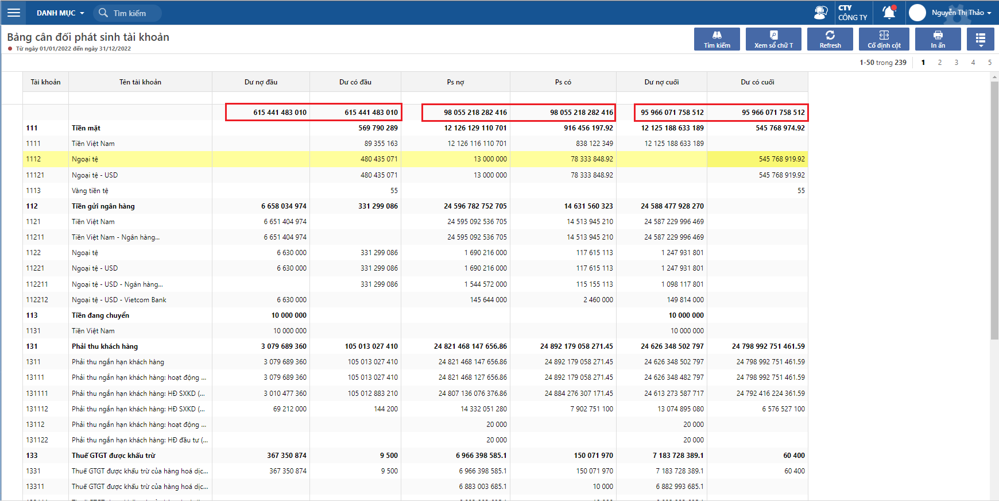<figcaption></figcaption></figure>

Bảng cân đối phát sinh tài khoản chính xác sẽ phải cân 2 bên Nợ và Có. Cụ thể từng cặp tương ứng phải bằng nhau là Dư nợ đầu= Dự có đầu, Ps nợ= Ps có, Dự nợ cuối= Dư có cuối.

Các tài khoản loại 1 và 2 thường chỉ có số dư Nợ và cũng không có số dư cuối kỳ âm ( trừ các tài khoản công nợ lưỡng tính 131,138,..)

Các tài khoản loại 3 và 4 thường chỉ có số dư Có và không có số dư cuối kỳ âm ( trừ các tài khoản công nợ lưỡng tính 331, 338…)

Với những tài khoản loại 5 đến loại 9: Sổ cái và cân đối phát sinh số dư phải bằng 0. Trường hợp nếu còn số dư thì có thể kiểm tra lại bút toán kết chuyển.

#### Kiểm tra bảng cân đối kế toán cân

<figure>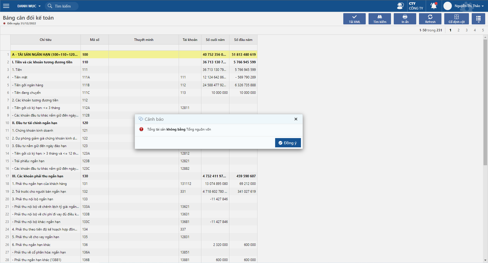<figcaption></figcaption></figure>

Đối với Bảng cân đối kế toán, Tổng Tài sản phải = Tổng nguồn vốn, nếu 2 bên không bằng nhau hệ thống sẽ đưa ra cảnh báo "_Tổng tài sản **không bằng** Tổng nguồn vốn"_

TH bảng cân đối kế toán không cân, có thể sử dụng chức năng Kiểm tra bảng cân đối kế toán không cân để kiểm tra nhanh

_Đường dẫn: **Kế toán/ Tổng hợp/ Tiện ích/ Kiểm tra bảng cân đối kế toán không cân**_

<figure>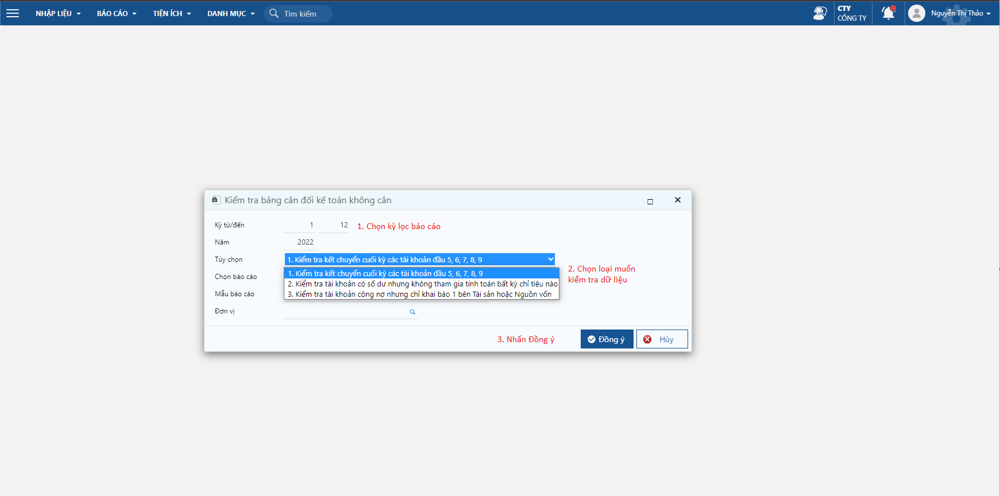<figcaption></figcaption></figure>

#### Kiểm tra chỉ tiêu Lợi nhuận Báo cáo kết quả kinh doanh

<figure>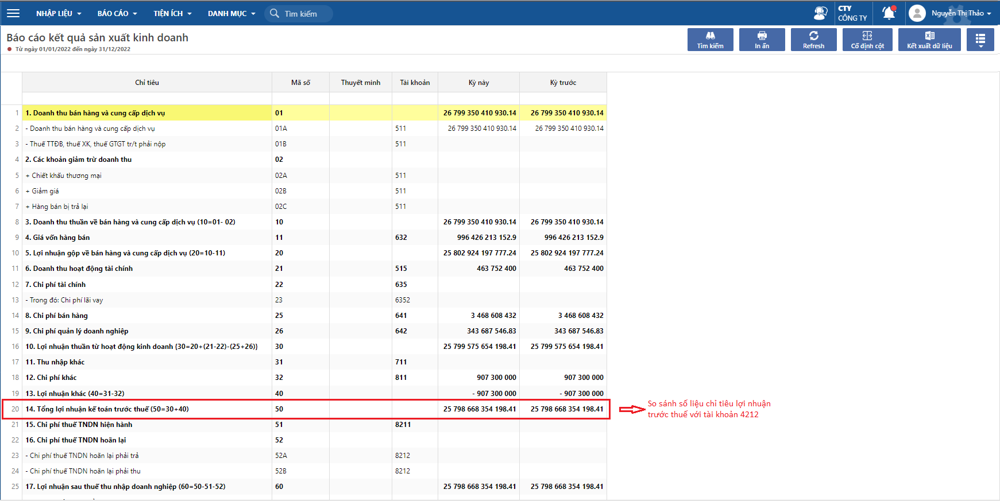<figcaption></figcaption></figure>

<figure>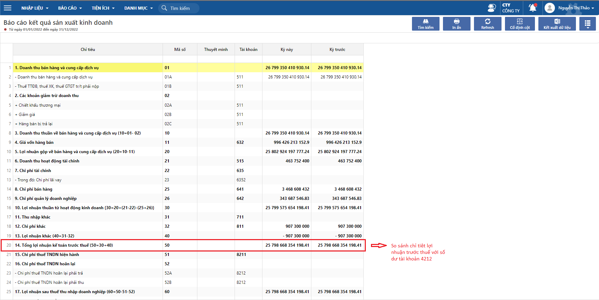<figcaption></figcaption></figure>

#### Kiểm tra chỉ tiêu Tiền và tương đương tiền cuối kỳ ở Báo cáo lưu chuyển tiền tệ

<figure>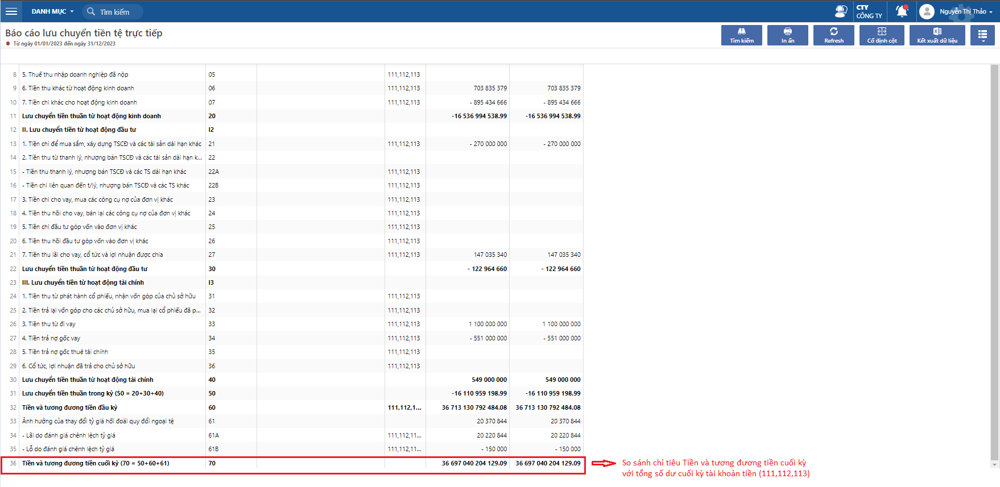<figcaption></figcaption></figure>

### Các tình huống chênh lệch báo cáo và cách kiểm tra, xử lý

#### Trường hợp Bảng cân đối kế toán không cân, đi vào đối chiếu từng chỉ tiêu ở Bảng cân đối kế toán với Bảng cân đối phát sinh để kiểm tra các chỉ tiêu sai lệch

Đối chiếu theo từng tài khoản ở Bảng cân đối phát sinh tài khoản có số dư cuối thời điểm kiểm tra Bảng cân đối kế toán: Cột số dư cuối Nợ/ Có ở Bảng cân đối phát sinh sẽ bằng cột Số cuối năm ở Bảng cân đối kế toán xét theo từng tài khoản. Cột số dư đầu Nợ/ Có ở bảng cân đối phát sinh sẽ bằng cột Số đầu năm ở bảng cân đối kế toán xét theo từng tài khoản.

VD: kiểm tra tài khoản 112

<figure>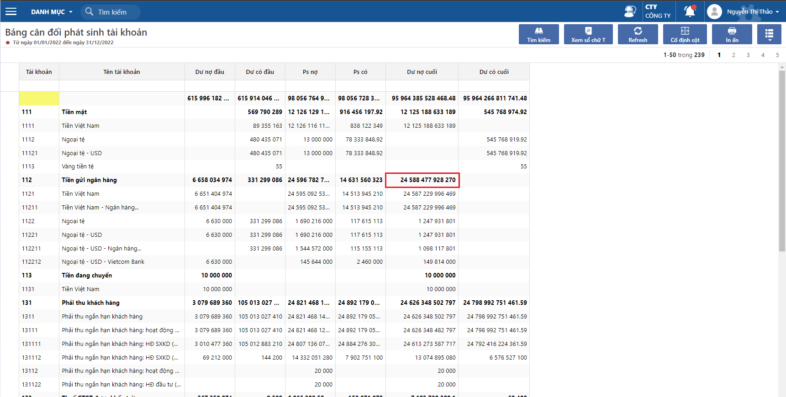<figcaption></figcaption></figure>

Đối chiếu Số cuối năm TK 112 ở Bảng cân đối kế toán với Dư nợ cuối TK 112 ở Bảng cân đối phát sinh tài khoản

#### Tương tự ở các báo cáo khác, kiểm tra các chỉ tiêu dựa vào số dư/ số phát sinh tài khoản để tìm ra được chỉ tiêu sai lệch

#### Xử lý nếu có sai lệch

**Bước 1:** Vào màn hình báo cáo báo cáo có chỉ tiêu sai lệch

<figure>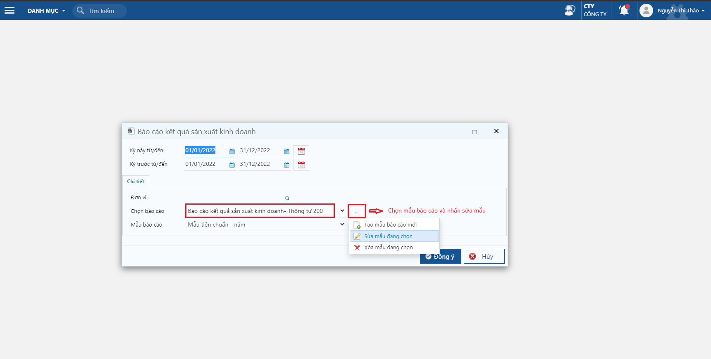<figcaption></figcaption></figure>

**Bước 2:** Kiểm tra các tài khoản được khai báo ở các chỉ tiêu đã đúng với tài khoản kế toán doanh nghiệp sử dụng hay chưa.

<figure>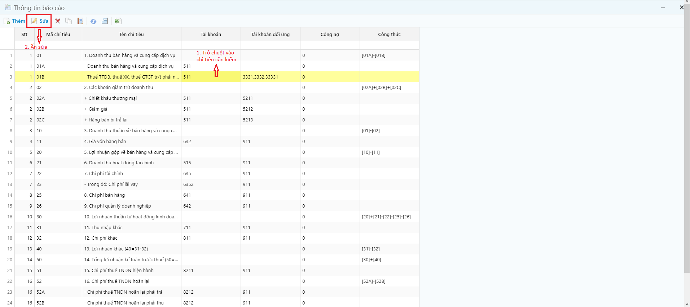<figcaption></figcaption></figure>

Ví dụ chỉ tiêu “Thuế TTĐB, thuế XK, thuế GTGT tr/t phải nộp” ở Báo cáo kết quả kinh doanh đang lấy dữ liệu từ tài khoản 511 có đối ứng với 3331,3332,33331. Trường hợp các tài khoản kế toán của doanh nghiệp theo dõi khác với tài khoản đã khai theo chỉ tiêu có thể điều chỉnh ở đây.

**Bước 3:** Kiểm tra loại dữ liệu và cách lấy dữ liệu

<figure>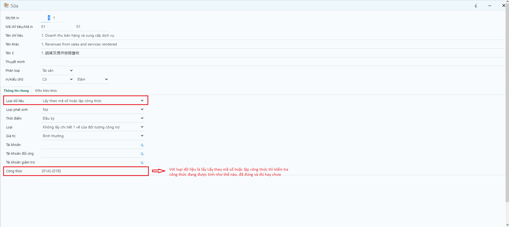<figcaption></figcaption></figure>

<figure>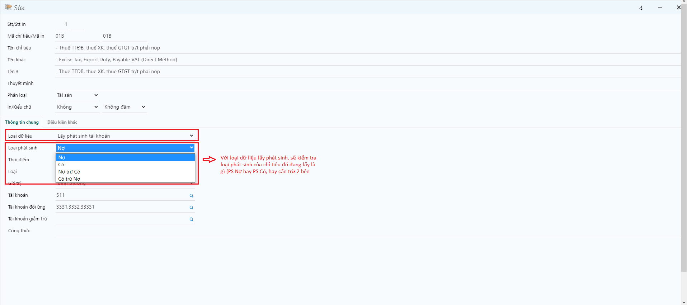<figcaption></figcaption></figure>

<figure>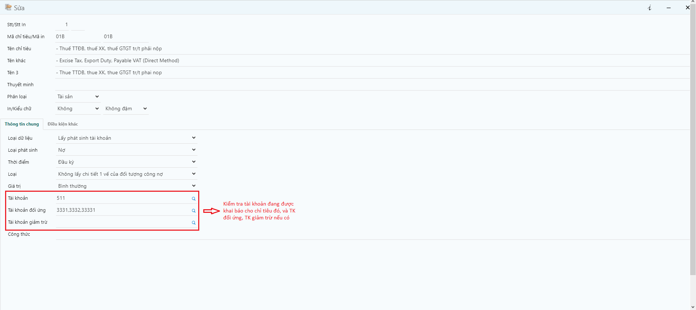<figcaption></figcaption></figure>

Ngoài ra, kiểm tra tài khoản được khai báo ở chỉ tiêu nào bằng cách lọc tài khoản ở cột Tài khoản hoặc cột Tài khoản đối ứng, sau đó kiểm tra lại mã tài khoản đã được khai đúng và đủ chưa, kiểm tra sự trùng lặp tài khoản nếu có.

<figure>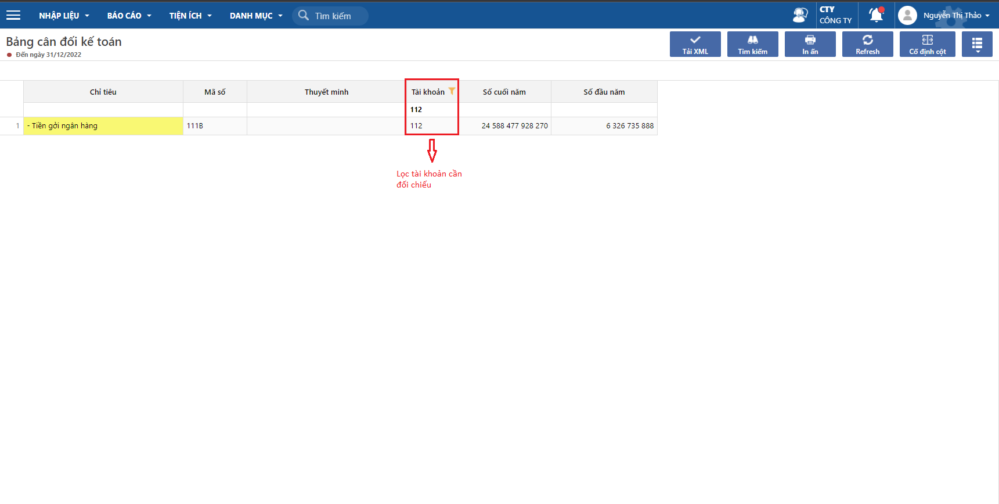<figcaption></figcaption></figure>
