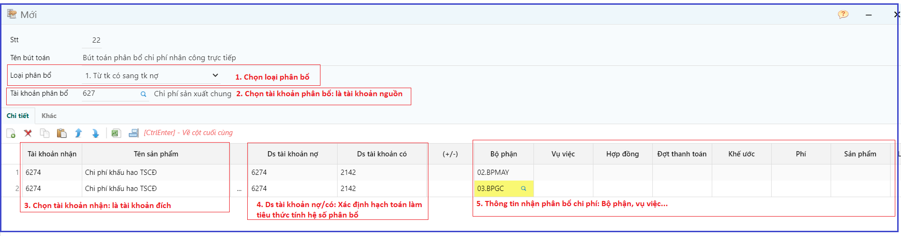
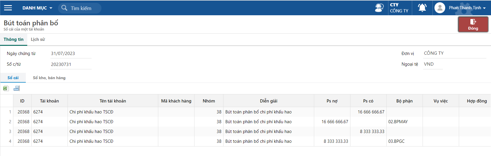

---
layout:
  title:
    visible: true
  description:
    visible: false
  tableOfContents:
    visible: true
  outline:
    visible: true
  pagination:
    visible: false
---

# Theo dõi chi phí chung, phân bổ chi phí chung cho nhiều bộ phận

Ghi nhận các nghiệp vụ liên quan đến chi phí chung của doanh nghiệp

Thao tác theo dõi và phân bổ chi phí chung cho các bộ phận của doanh nghiệp.

Tiện ích sử dụng trong các trường hợp:

* Phân bổ chi phí sản xuất chung, chi phí lương… phục vụ cho tính giá thành sản phẩm
* Phân bổ chi phí bán hàng, chi phí quản lý hoặc các khoản chi phí hạch toán chung cần phân bổ về đối tượng bộ phận hay vụ việc.

## Khai báo hệ thống

Khai báo cấu trúc phân bổ, tài khoản hạch nguồn, tài khoản đích và các đối tượng nhận phân bổ chi phí. Khai báo này chỉ khai báo một lần và chạy chức năng tự động vào cuối kỳ

Đường dẫn: _**Tổng hợp/ Nhập liệu/ Khai báo bút toán phân bổ**_

## Các bước hướng dẫn

**Bước 1:** Kiểm tra hạch toán chi phí chung

Đường dẫn: _**Tổng hợp/ Nhập liệu/ Phiếu kế toán (Phiếu kế toán theo nghiệp vụ)**_

.png>)

Kiểm tra về hạch toán nợ/có của các phát sinh liên quan đến chi phí chung.

Kiểm tra số tiền hạch toán trong kỳ.

**Bước 2:** Chạy tính năng phân bổ tự động.

Đường dẫn: _**Tổng hợp/ Nhập liệu/ Bút toán phân bổ**_

.png>)

.png>)

(1) Chọn bút toán cần phân bổ

(2) Nhấn “Tính hệ số”, chương trình sẽ tính hệ số phân bổ theo đối tượng đã được khai báo ở B1.

Hệ thống dựa vào phát sinh Ds tài khoản nợ/ Ds tài khoản có để xác định hệ số phân bổ.

(3) Hệ số chương trình tính sẽ được cập nhật vào cột này.

(4) Sau khi tính hệ số hoặc có thay đổi về hệ số, người dùng có thể chủ động nhập hệ số và thực hiện lưu lại.

(5) Nút này dùng để tính hệ số đồng loạt cho nhiều bút toán.

(6) Sau khi kiểm tra hệ số nhấn nút Phân bổ

(7) Trường hợp cần xoá bút toán phân bổ

**Bước 3:** Kiểm tra lại bút toán phân bổ

