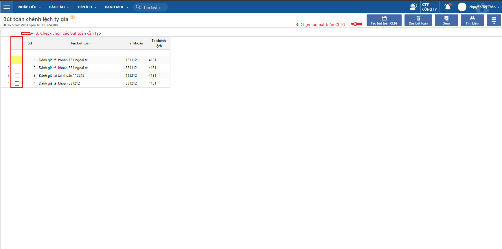

---
layout:
  title:
    visible: true
  description:
    visible: false
  tableOfContents:
    visible: true
  outline:
    visible: true
  pagination:
    visible: false
---

# Theo dõi đánh giá lại chênh lệch tỷ giá hoá đơn, tỷ giá tài khoản và cách xử lý chênh lệch

Tài liệu hướng dẫn cách đánh giá lại tỷ giá ở thời điểm cuối kỳ lập BCTC theo tỷ giá hối đoái giao dịch thực tế tại thời điểm báo cáo và cách xử lý chênh lệch tỷ giá do đánh giá lại.

## Hướng dẫn thao tác

### Đánh giá lại tỷ giá công nợ hoá đơn

Chức năng này dùng để đánh giá lại tỷ giá cho các Hóa đơn phải thu và phải trả vào cuối năm tài chính, chỉ dùng khi có theo dõi công nợ theo hóa đơn hoặc có thu, chi theo hóa đơn.

_Đường dẫn: **Kế toán/ Bán hàng/ Tiện ích/ Đánh giá chênh lệch tỷ giá hoá đơn**_

<figure><figcaption></figcaption></figure>

Sau khi chạy chức năng trên, hệ thống sẽ điều chỉnh tỷ giá của hoá đơn hiện tại về tỷ giá đánh giá lại, sau thời điểm đánh giá khi có thanh toán cho hóa đơn thì sẽ hiểu theo tỷ giá mới.

### Đánh giá lại tỷ giá tài khoản

**Bước 1:** Khai báo bút toán chênh lệch tỷ giá

Dùng để khai báo các bút toán đánh giá chênh lệch tỷ giá cuối kỳ đối với các tài khoản có phát sinh ngoại tệ.

_Đường dẫn: **Tổng hợp/ Nhập liệu/ Khai báo/ Khai báo các bút toán chênh lệch tỷ giá**_

<figure><figcaption></figcaption></figure>

**Bước 2:** Chạy bút toán đánh giá chênh lệch tỷ giá

_Đường dẫn: **Kế toán/ Tổng hợp/ Nhập liệu/Đầu kỳ/ Bút toán chênh lệch tỷ giá**_

<figure><figcaption></figcaption></figure>

<figure><figcaption></figcaption></figure>

Sau khi chạy bút toán đánh giá chênh lệch, để kiểm tra các bút toán vừa tạo thì chọn xem định khoản ở góc phải màn hình

<figure><figcaption></figcaption></figure>

**Bước 3:** Xử lý chênh lệch tỷ giá do phát sinh đánh giá lại chênh lệch tỷ giá

Tổng hợp lại số phát sinh nợ và phát sinh có của tài khoản 4131 vừa được sinh ra ở các bút toán đánh giá chênh lệch tỷ giá.

_Đường dẫn: **Kế toán/ Báo cáo/ Sổ kế toán/ Sổ cái của một tài khoản**_

<figure><figcaption></figcaption></figure>

<figure><figcaption></figcaption></figure>

TH1: Phát sinh nợ > Phát sinh có -> Kết chuyển lỗ tỷ giá hối đoái do đánh giá lại chênh lệch tỷ giá

Sử dụng Phiếu kế toán và hạch toán cặp định khoản:

Nợ TK 635

Có TK 4131

Với giá trị bằng Phát sinh nợ - Phát sinh có

Đường dẫn: _**Kế toán/ Tổng hợp/ Phiếu kế toán**_

<figure><figcaption></figcaption></figure>

TH2: Phát sinh nợ < Phát sinh có -> Kết chuyển lãi tỷ giá hối đoái do đánh giá lại chênh lệch tỷ giá

Sử dụng Phiếu kế toán và hạch toán cặp định khoản:

Nợ TK 4131

Có TK 515

Với giá trị bằng Phát sinh có - Phát sinh nợ

Đường dẫn: _**Kế toán/ Tổng hợp/ Phiếu kế toán**_

<figure><figcaption></figcaption></figure>
