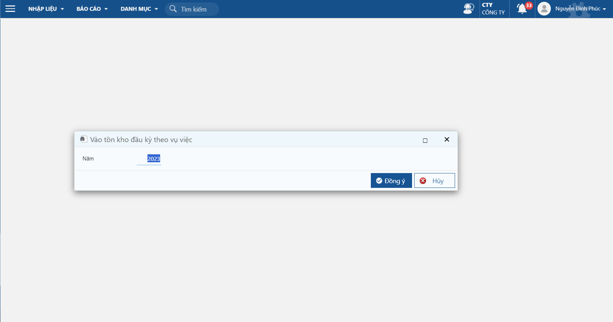
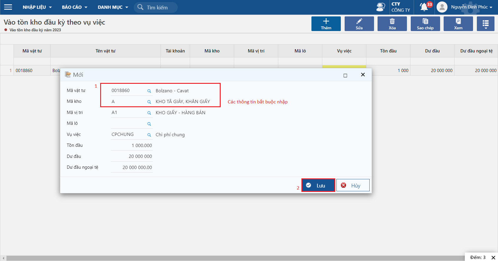
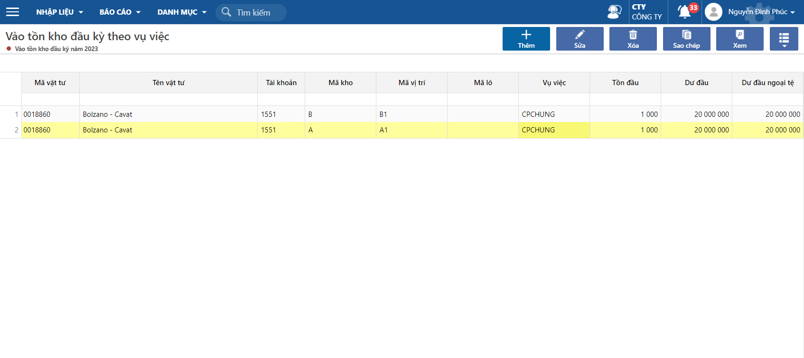

---
layout:
  title:
    visible: true
  description:
    visible: false
  tableOfContents:
    visible: true
  outline:
    visible: true
  pagination:
    visible: true
---

# Cập nhật số dư đầu kỳ tồn kho theo vụ việc - Phúc

## Hướng dẫn thao tác

#### Trường hợp 1: Nhập tay từ bàn phím

**Bước 1:** Vào màn hình: Vào tồn kho đầu kỳ, vụ việc

Đường dẫn: _**Vụ việc/ Nhập liệu/ Đầu kỳ/ Vào tồn kho đầu kỳ theo vụ việc**_

<figure><figcaption>
Vào tồn kho đầu kỳ theo vụ việc
</figcaption></figure>

**Bước 2**: Thêm mới tồn kho đầu kỳ của vật tư

<figure><figcaption></figcaption></figure>

**Bước 3:** Kiểm tra lại các thông tin sau khi Lưu

<figure><figcaption></figcaption></figure>

#### Trường hợp 2: Import dữ liệu từ excel

Cách import từ excel, xem hướng dẫn [tại đây](http://127.0.0.1:5000/s/rcD7ImF1NXzNzFohN8p5/thao-tac-chuc-nang-tren-he-thong/import-du-lieu-tu-excel-vao-chuong-trinh)
