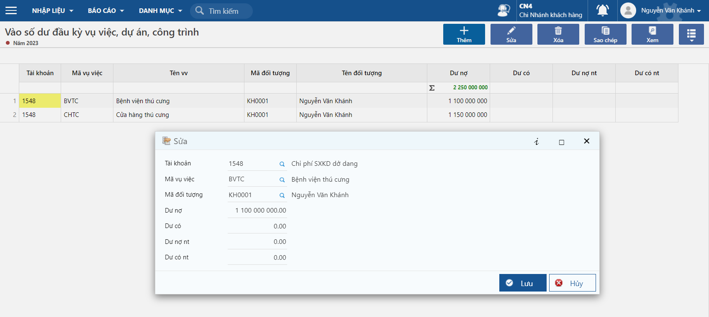
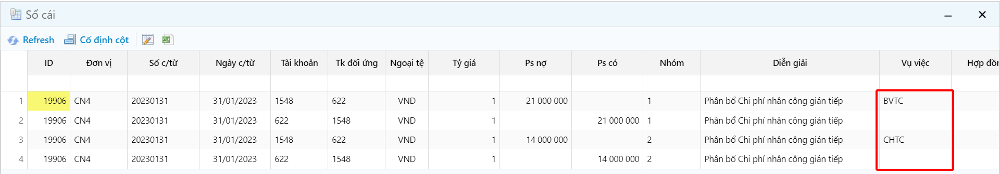
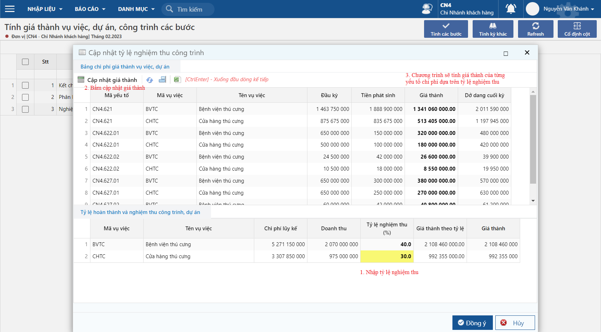

---
layout:
  title:
    visible: true
  description:
    visible: false
  tableOfContents:
    visible: true
  outline:
    visible: true
  pagination:
    visible: false
---

# TÍNH GIÁ THÀNH VỤ VIỆC

## Giới thiệu chung

### Đối tượng sử dụng tài liệu

Tài liệu này được xây dựng để hỗ trợ khách hàng nắm được cách thức sử dụng chương trình, qua đó có thể thực hiện tốt các công việc được giao trong các bước để tính Giá thành trong hệ thống

### Những tính năng cơ bản

* Theo dõi chi phí sản xuất theo đối tượng vụ việc – công trình
* Cập nhật hệ số phân bổ cho giá thành

### Quy trình tính giá thành vụ việc

<figure><figcaption></figcaption></figure>

## Danh mục

### Danh mục vụ việc, dự án, công trình

Đường dẫn: _**Vụ việc/Nhập liệu/Danh mục vụ việc, dự án, công trình**_

.png>)

**Giải thích các trường thông tin**

* Mã vụ việc: mã dự án, công trình, vụ việc theo dõi tính giá thành
* Tên vụ việc/Tên khác: tên dự án, công trình, vụ việc

**Thông tin chung**

* Ngày vụ việc: ngày bắt đầu theo dõi, ngày bắt đầu dự án
* Số vụ việc: do người dùng tự đặt có thể là số hợp đồng, số dự án,..
* Theo dõi số dư: vụ việc có theo dõi số dư theo đối tượng cụ thể thì chọn có, nếu không theo dõi theo một đối tượng cụ thể thì chọn không
* Ngoại tệ: loại tiền của dự án, công trình, vụ việc
* Tiền ngoại tệ: giá trị của dự án bằng ngoại tệ
* Tiền hạch toán: giá trị của dự án bằng tiền hạch toán (VND)
* Ngày bắt đầu/Ngày kết thúc: ngày bắt đầu thực hiện và kết thúc của dự án
* Mã vụ việc mẹ: trường hợp dự án có phát sinh phụ lục, thì chọn mã dự án trước đó.
* Trạng thái: còn theo dõi thì chọn 1. Còn sử dụng, không theo dõi chọn 2. Không sử dụng

### Danh mục phân nhóm yếu tố

Đường dẫn: _**Vụ việc/Nhập liệu/Danh mục phân nhóm yếu tố**_

.png>)

Danh mục nhóm yếu tố dùng để phân nhóm chi phí, thuộc các nhóm nguyên vật liệu, nhân công, chi phí sản xuất chung.

### Danh mục yếu tố chi phí

Đường dẫn: _**Vụ việc/Nhập liệu/Danh mục yếu tố chi phí**_

.png>)

**Giải thích các trường thông tin**

* Phân loại: dùng để phân loại yếu tố để chương trình sinh tự động bút toán kết chuyển tương ứng

\+ Doanh thu: sinh một bút toán kết chuyển doanh thu Nợ 511/Có 911, cần có bút toán này để chương trình tính được phần doanh thu của kỳ tính giá thành

\+ Chi phí: sinh một bút toán kết chuyển chi phí Nợ 911/Có 62x

* Nhóm yếu tố: phân loại nhóm là chi phí nguyên vật liệu, nhân công, sản xuất chung

\+ Chi phí trực tiếp: khi nhập liệu người dùng sẽ xác định được chi phí phát sinh của vụ việc nào, chương trình sẽ kết chuyển theo từng vụ việc

\+ Chi phí chung: chương trình hiện tab Tiêu thức phân bổ chi phí chung, người dùng khai báo tiêu thức phân bổ cho các chi phí chung này, nếu người dùng không phân bổ theo hệ số của yếu tố khác, người dùng có thể cập nhật hệ số tự tính ở bước Tính giá thành

.png>)

## Khai báo

### Khai báo bút toán kết chuyển

Đường dẫn: _**Vụ việc/Nhập liệu/Khai báo bút toán kết chuyển**_

.png>)

Khi khai báo danh mục yếu tố chi phí, các yêu tố là chi phí trực tiếp, kết chuyển giá vốn, nghiệm thu công trình, chương trình sẽ tạo một bút toán kết chuyển tương ứng, kết chuyển các phát sinh chi tiết theo từng vụ việc, người dùng có thể điều chỉnh lại các thông tin bút toán.

### Khai báo bút toán phân bổ vụ việc, dự án

Đường dẫn: _**Vụ việc/Nhập liệu/Khai báo bút toán phân bổ vụ việc, dự án**_

.png>)

* Khi khai báo danh mục yếu tố chi phí, các yêu tố là chi phí chung không xác định được chi phí thuộc vụ việc, dự án nào để kết chuyển, chương trình sẽ sinh tự động bút toán phân bổ dựa trên khai báo yếu tố chi phí chung trước đó.
* Người dùng có thể khai báo lại bút toán, phân bổ dựa trên hệ số của tài khoản nợ và tài khoản có phát sinh theo vụ việc, hoặc không phân bổ theo hệ số phát sinh, người dùng có thể tự nhập hệ số tại bước Tính giá thành.

### Cập nhật đầu kỳ

#### Vào số dư đầu kỳ vụ việc, dự án, công trình

Đường dẫn: **Vụ việc/Nhập liệu/Vào số dư đầu kỳ vụ việc, dự án, công trình**

Người dùng cập nhật số dư dở dang đầu kỳ cho VV-DA-CT, chỉ cập nhật cho lần đầu sử dụng chương trình, qua các kỳ chương trình sẽ tự kết chuyển số dư dở dang cuối kỳ.

### Cập nhật giá trị dở dang cuối kỳ

Đường dẫn: _**Vụ việc/Nhập liệu/Vào số dư đầu kỳ vụ việc, dự án, công trình**_

.png>)

Người dùng cập nhật số dư dở dang cuối kỳ tính, phần này chỉ cập nhật cho lần bắt đầu sử dụng phần mềm, người dùng cần cập nhật các yếu tố dở dang cuối kỳ trước khi đưa vào phần mềm, để tính được phần giá trị lũy kế, đến thời điểm nghiệm thu giá trị lũy kế là bao nhiêu, chương trình sẽ tính giá thành.

## Nhập liệu chứng từ

### Chứng từ xuất kho

Đường dẫn: _**Kho/Nhập liệu/Xuất kho**_

.png>)

### Chứng từ ghi nhận chi phí

Đường dẫn: _**Tổng hợp/Nhập liệu/Phiếu kế toán**_

.png>)

## Tính giá thành

Đường dẫn: _**Vụ việc/Nhập liệu/Tính giá thành**_

.png>)

* Giá thành vụ việc có ba bước tính:

**Bước 1** **kết chuyển chi phí trực tiếp**: cuối kỳ kế toán, kế toán tiến hành kết chuyển chi phí phát sinh sang tài khoản 154, theo chi tiết từng dự án, công trình, vụ việc.

.png>)

* Sau khi tính người dùng bấm xem kết quả để kiểm tra bút toán kết chuyển

.png>)

\+ **Bước 2 phân bổ chi phí chung**: Các yếu tố chi phí chung, được cập nhật tại bước này để phân bổ chi phí cho các dự án. Để cập nhật hệ số phân bổ, người dùng bấm vào cập nhật dự án phát sinh và phân bổ.

.png>)

* Sau khi tính phân bổ người dùng bấm xem kết quả để kiểm tra phân bổ chi phí chung.

\+ **Bước 3 nghiệm thu công trình**: khi cần nghiệm thu, để kết chuyển từ dở dang sang giá vốn, người dùng tính giá trị nghiệm thu tại đây, chương trình sẽ tạo hạch toán kết chuyển từ dở dang sang giá vốn. Để tính giá nghiệm thu người dùng bấm vào Nhập tỷ lệ hoàn thành và nghiệm thu

* Bước 3.1: người dùng bấm cập nhật giá thành, chương trình sẽ tính chi phí dở dang cuối kỳ, bao gồm khoản chi phí phát sinh trong kỳ và khoản lũy kế chi phí của kỳ trước.

.png>)

* Bước 3.2: Người dùng nhập tỷ lệ nghiệm thu, để tính được giá thành tại thời điểm thu tiền.

.png>)

* Bước 3.3: Trường hợp tỷ lệ nghiệm thu có giá trị không tròn, người dùng có thể điều chỉnh giá thành tỷ lệ, chương trình sẽ tính lại giá thành theo giá thành tỷ lệ vừa thay đổi.

* Bước 3.4: Bấm đồng ý, chương trình sẽ tạo bút toán kết chuyển từ dở dang sang tài khoản giá vốn.

.png>)

## Báo cáo giá thành

### Bảng tổng hợp chi phí của các dự án, công trình

Đường dẫn: _**Vụ việc/Báo cáo/Bảng tổng hợp chi phí của các dự án, công trình**_

.png>)

Báo cáo tổng hợp tất cả chi phí sản xuất của các dự án công trình, dựa vào đây người dùng có thể tổng quan được chi phí sản xuất, tình hình nghiệm thu dự án.

### Báo cáo KQ SXKD theo công trình, vụ việc

Đường dẫn: _**Vụ việc/Báo cáo/ Báo cáo KQ SXKD theo công trình, vụ việc**_

<figure><figcaption></figcaption></figure>

* Sau khi kết chuyển chi phí, giá vốn, doanh thu người dùng có thể xem báo cáo kết quả sản xuất kinh doanh theo công trình dự án.
